# 01 ROS 发展史

> 从起源到生态。

为什么在写第一个 Hello World 之前，要先学"考古"？因为看不懂节点通讯、不知道为何报错，往往是对框架的来源与设计一无所知。本章用三站地图讲清 ROS 的演进。

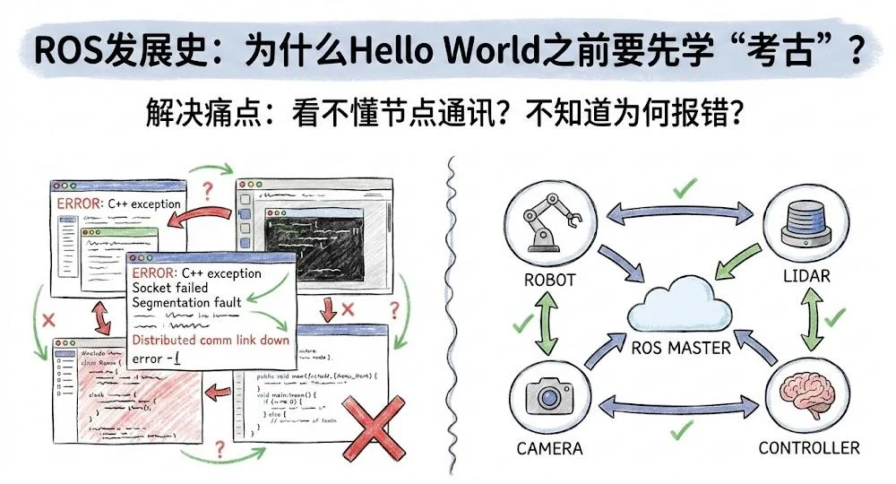

## 本章地图

| 站     | 主题             | 关键内容                                |
| ------ | ---------------- | --------------------------------------- |
| 第一站 | ROS 起源         | 2007 年，斯坦福 STAIR 项目与 PR2 机器人 |
| 第二站 | ROS 1 架构解密   | Node、Topic、Service、Master            |
| 第三站 | 工业界的至暗时刻 | 实时性、安全性、稳定性缺陷              |

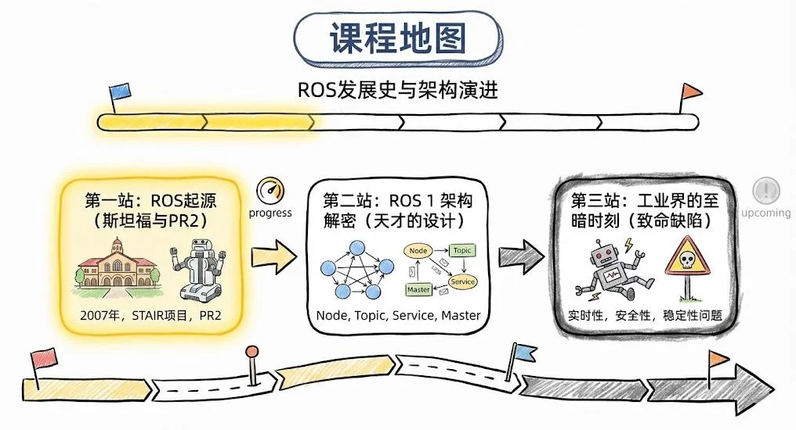

---

## 一、ROS 究竟是什么

### 1.1 从实验室宠儿到工业困境

ROS 最初是学术界的"宠儿"，在实验室里大放异彩；但到了真实工业现场，却频频暴露问题。

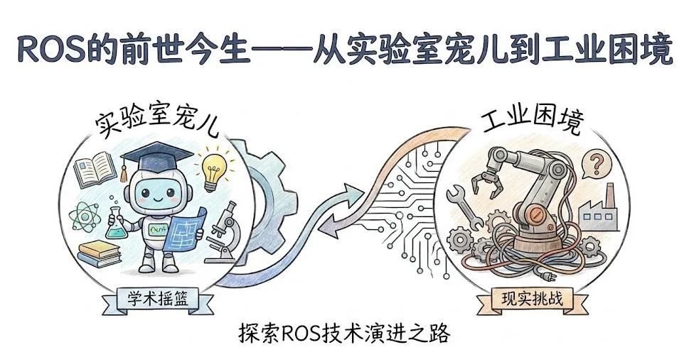

### 1.2 破除迷思：ROS 不是操作系统

- **ROS ≠ OS（操作系统）**：操作系统是 Windows / Linux 这类底层平台。
- **ROS = Middleware（中间件 / 通用语言）**：它更像"积木、胶水、工具箱"，把各个模块粘合起来。

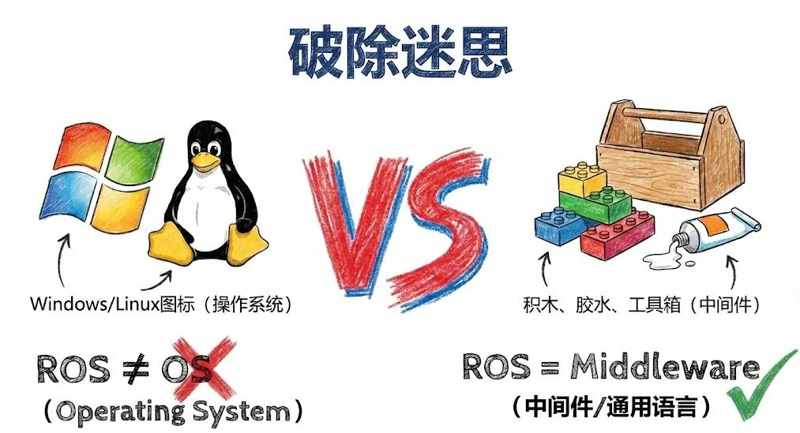

### 1.3 ROS 的三大支柱

| 支柱         | 说明                             |
| ------------ | -------------------------------- |
| **通讯机制** | 节点之间如何对话                 |
| **生态系统** | 丰富的功能包，像应用商店         |
| **工具箱**   | Rviz（可视化）、Gazebo（仿真）等 |

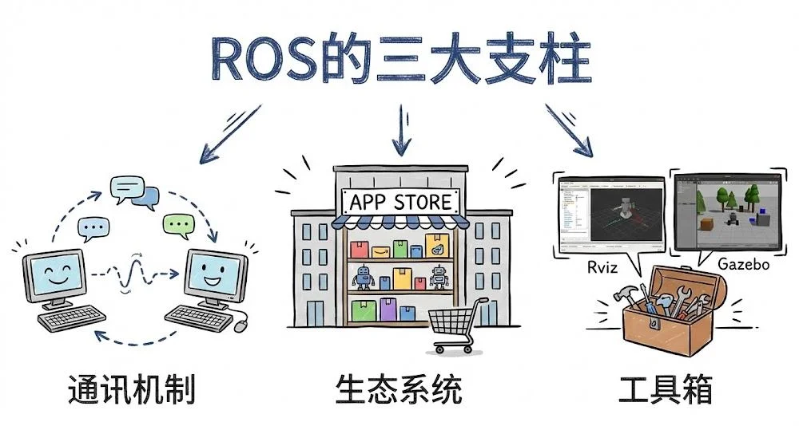

### 1.4 90% vs 10% 的困局

- **图 A（无 ROS）**：90% 的精力花在写驱动/框架上，只有 10% 用来做算法。
- **图 B（有 ROS）**：反过来，90% 用来做算法，10% 用来配置。

这正是 ROS 的价值所在——把重复的底层工作交给框架。

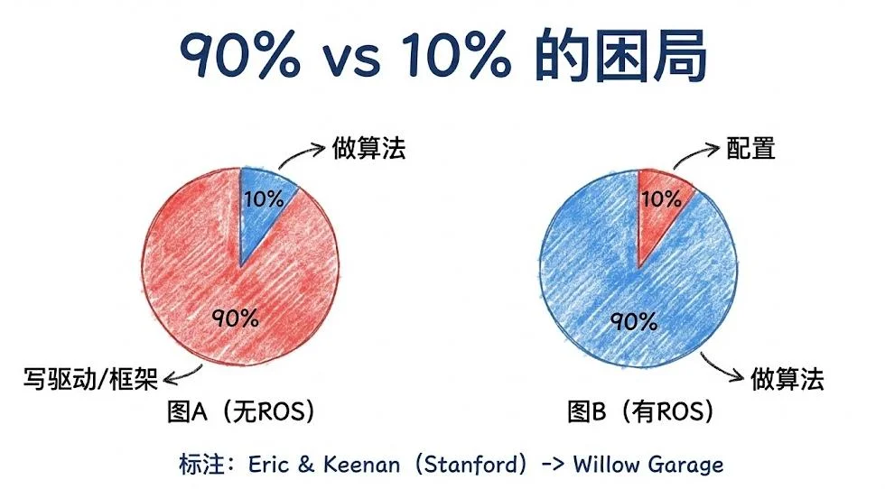

### 1.5 烟囱式开发 vs ROS 生态

传统"烟囱式开发"：视觉、导航、控制各自独立，从底座修到顶端，互不兼容。

ROS 生态则像乐高积木：各模块可以自由拼装、协作复用。

> 告别"烟囱式开发"，拥抱"模块化协作"。

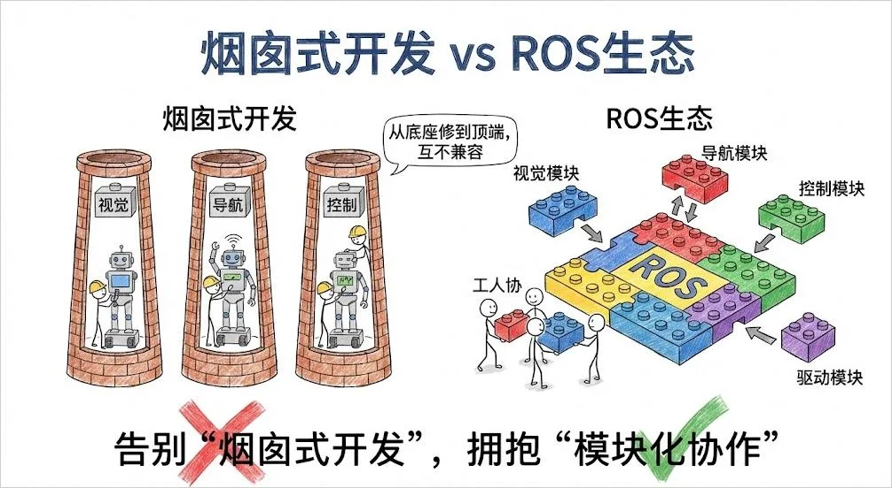

---

## 二、ROS 1 的架构与致命缺陷

### 2.1 核心架构：Master 中心化

ROS 1 依靠 **Master** 节点做中心协调：节点启动后先向 Master "握手"注册，之后彼此建立 **P2P 连接（TCP/UDP）** 直接通讯。

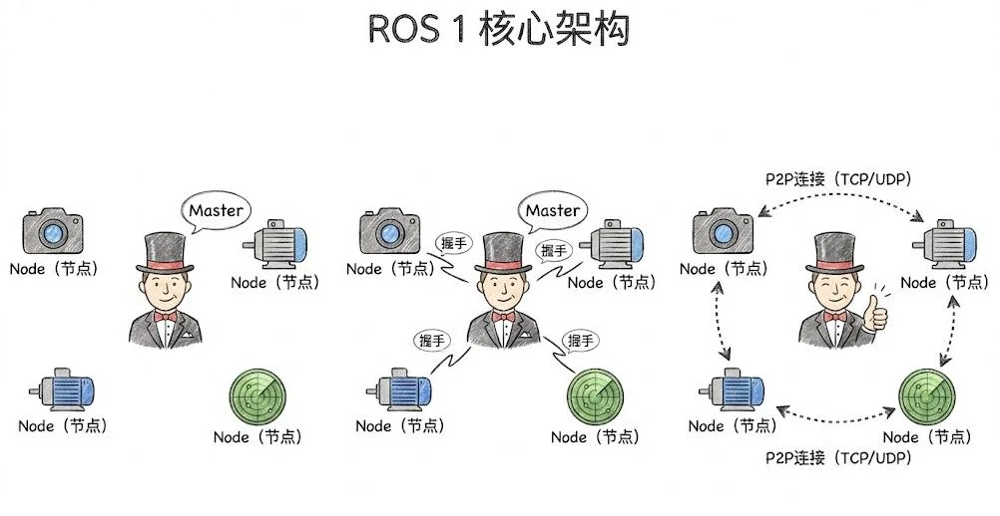

### 2.2 从实验室到现实的落差

ROS 1 是"才华横溢的天才少年"，但它是**温室花朵**——只能在实验室的舒适环境里工作，无法适应工厂（丛林法则）。

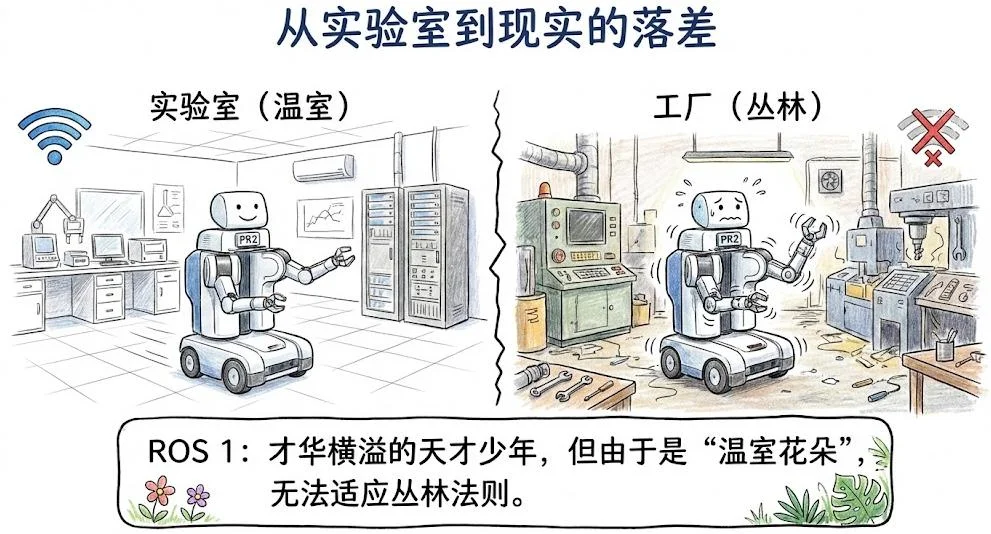

### 2.3 致命缺陷 1：单点故障

一切依赖 Master。一旦 Master 挂了，所有节点失联，机器人直接**瘫痪**。

> Centralized（中心化）＝ Single Point of Failure（单点故障）

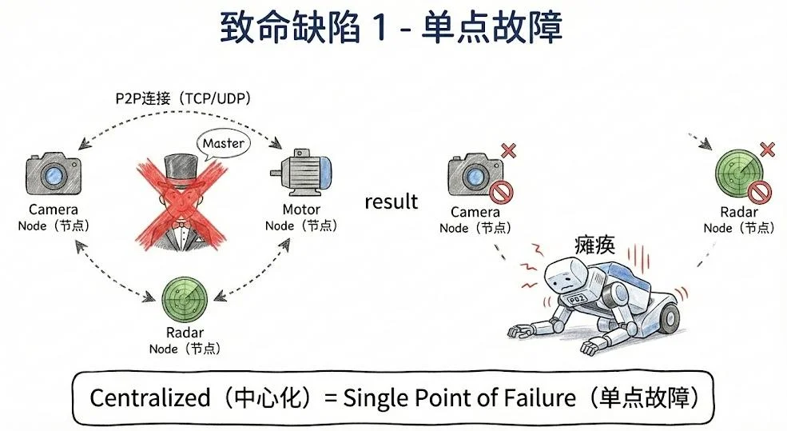

### 2.4 致命缺陷 2 & 3：安全与实时

- **Security（安全）**：无加密、无认证，数据在网络上"裸奔"，易被窃取。
- **Real-time（实时）**：只有软实时（尽力而为），任务响应时间波动大，做不到硬实时（必须达成）。

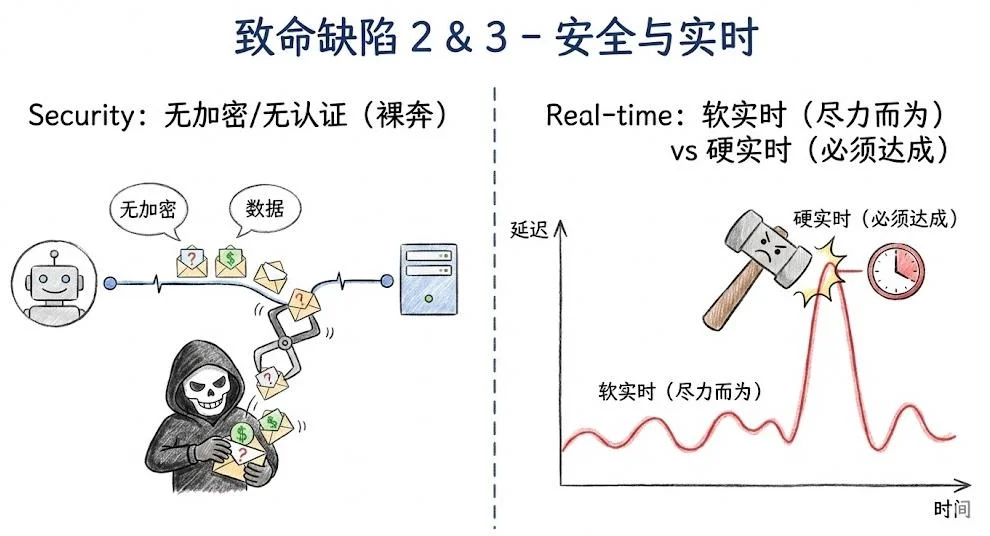

### 2.5 小结

| 回顾 ROS 1    | 预告 ROS 2       |
| ------------- | ---------------- |
| Master 中心化 | 如何"去中心化"？ |
| 不安全        | DDS 是什么？     |
| 非实时        | 硬实时如何实现？ |

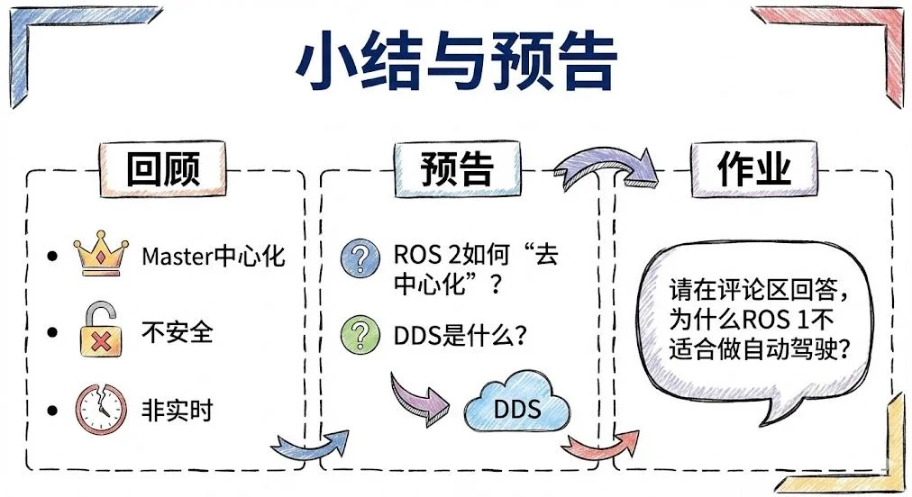

---

## 三、ROS 2 的破局革新

### 3.1 重构而非升级

> Not an Upgrade, It's a Revolution（不是升级，是革命）。

从 ROS 1 的"滑板少年"到 ROS 2 的"西装工程师"，这是一次**重构**，而非小版本迭代。

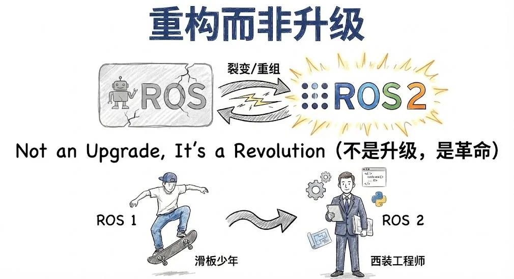
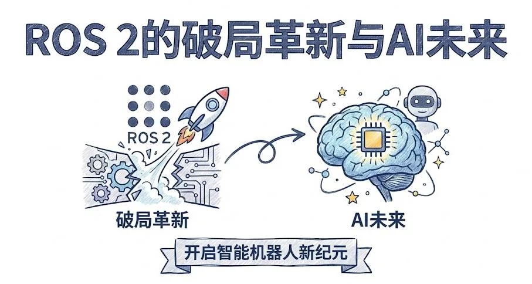

### 3.2 核心变革：去中心化与 DDS

ROS 2 去掉了中心化的 Master，改用 **DDS（Data Distribution Service）**——一种负责数据分发的中间件。每个节点自带 DDS，彼此直接通讯，没有单点。

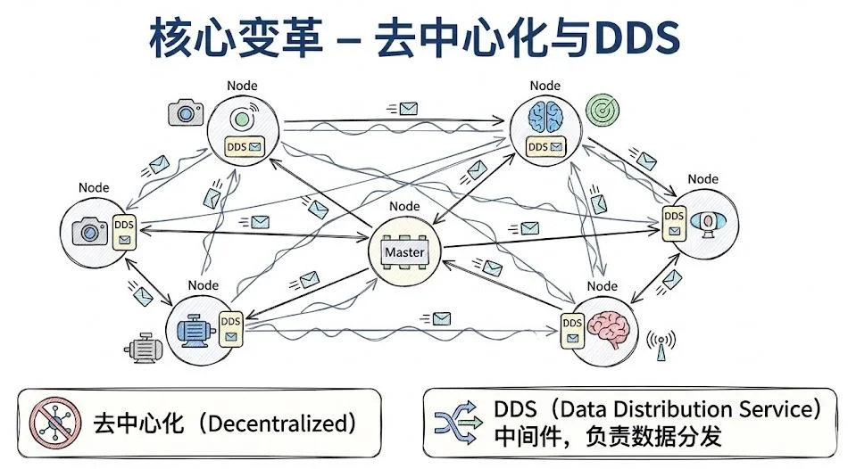

### 3.3 硬实力提升：实时性

- ROS 1（Linux）：任务响应时间**波动大**。
- ROS 2（RTOS）：响应时间**恒定**，支持硬实时。

> 硬实时（Hard Real-time）：确定性 > 速度。

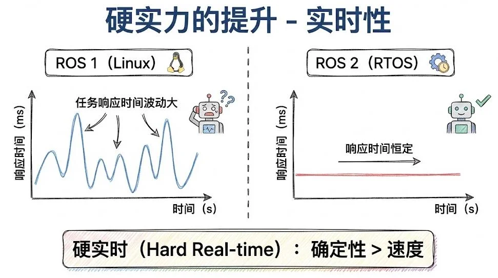

### 3.4 安全与跨平台

- **SRoS（Secure ROS）**：为数据流加密，是商业化的必选项。
- **跨平台**：不再局限于 Linux，同时支持 Windows 与 Mac。

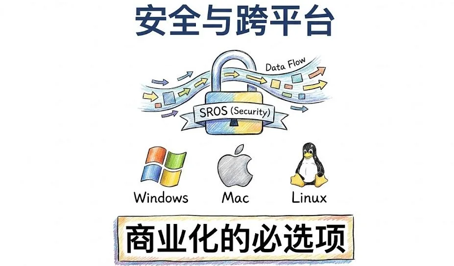

### 3.5 巅峰对决表

| 特性   | ROS 1                     | ROS 2                           |
| ------ | ------------------------- | ------------------------------- |
| 架构   | Master 中心化             | DDS 去中心化                    |
| 通讯   | TCPROS / UDPROS（Legacy） | DDS（Standard）                 |
| 实时性 | 无                        | 支持硬实时                      |
| 安全   | 无                        | SRoS（Secure ROS）              |
| 平台   | 主要 Linux                | 全平台（Windows / Mac / Linux） |

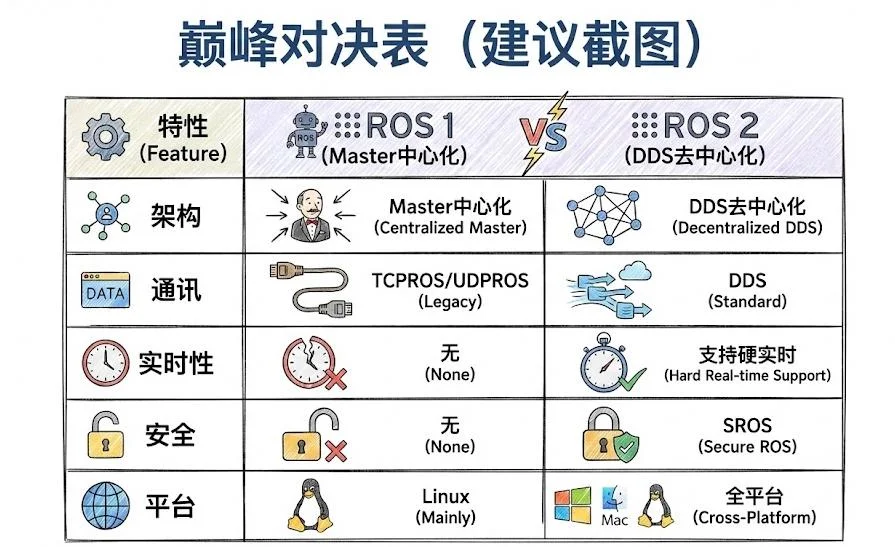

---

## 四、三大未来趋势

1. **具身智能（AI + Robotics）**
2. **云机器人（Cloud）**
3. **微型化（MicroROS）**

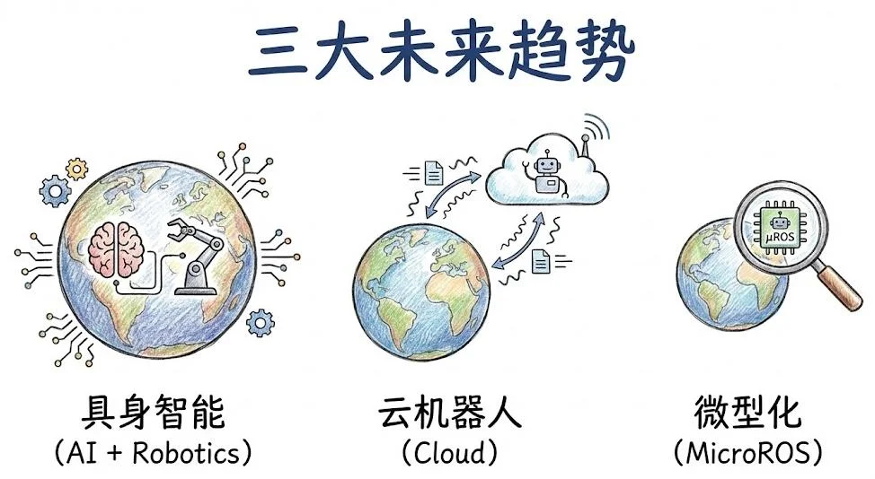

### 4.1 具身智能

用户说"去厨房拿咖啡"，**大脑（LLM）**解析意图并生成 ROS 指令，**小脑（ROS）**负责导航与机械臂抓取。

> 从"命令式编程"到"目标导向编程"。

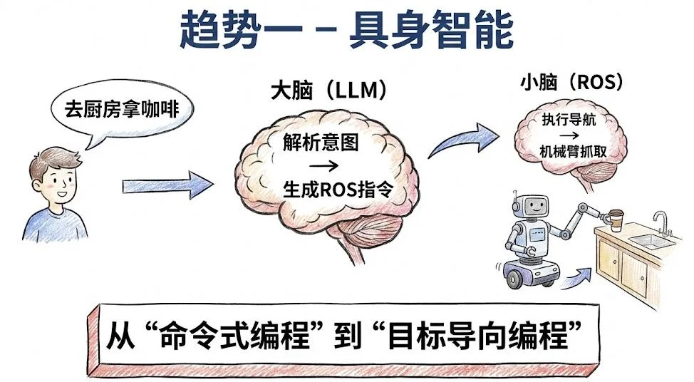

### 4.2 云端与微型化

- **Cloud Robotics（算力在云）**：算力放在云端，大量机器人集群协作。
- **MicroROS（万物互联）**：把 ROS 塞进单片机与传感器，接入灯、手表、汽车等海量设备。

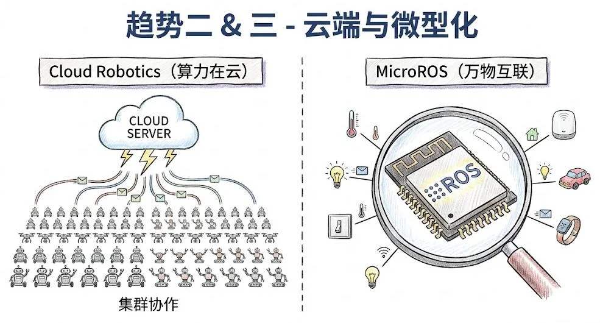

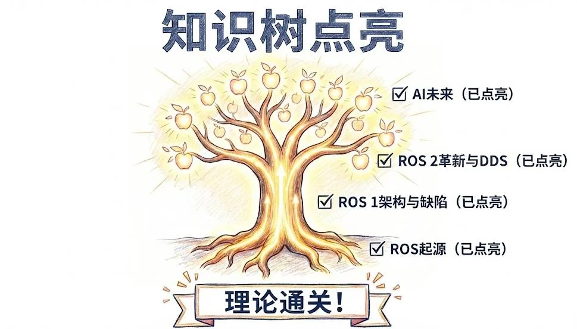

---

## 本章小结

- **ROS 不是操作系统**：它是中间件——通讯机制 + 生态 + 工具箱。
- **ROS 1 的三处硬伤**：Master 中心化导致单点故障、无加密认证、只有软实时。
- **ROS 2 的破局**：DDS 去中心化、支持硬实时、SRoS 安全、全平台。
- **三大趋势**：具身智能、云机器人、微型化（MicroROS）。

---

## 课后作业

- **（基础）** ROS 2 是用什么技术取代了 Master？
- **（思考）** 如果让你做一个简单的循迹小车，你会选 ROS 1 还是 ROS 2？为什么？

> 下节课预告：《手把手教你搭建 ROS 2 开发环境》

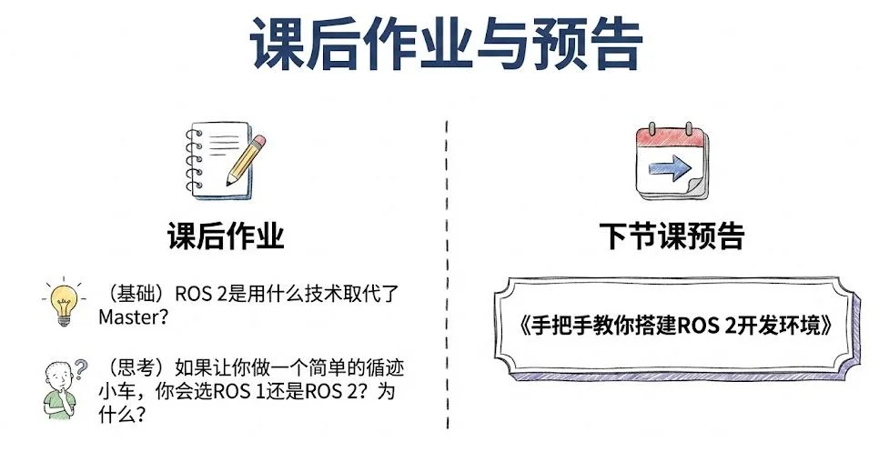
