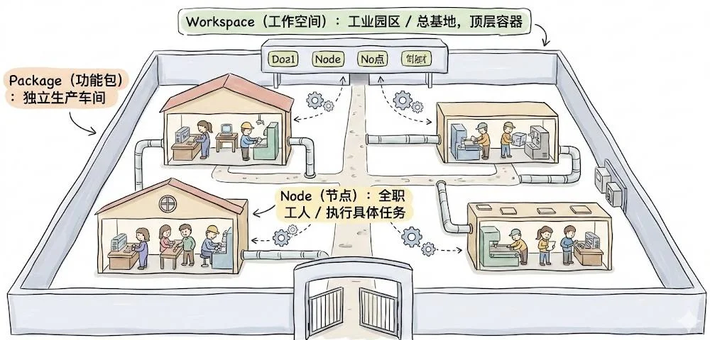
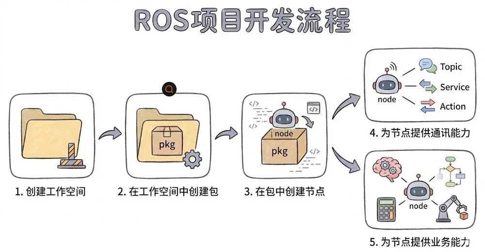
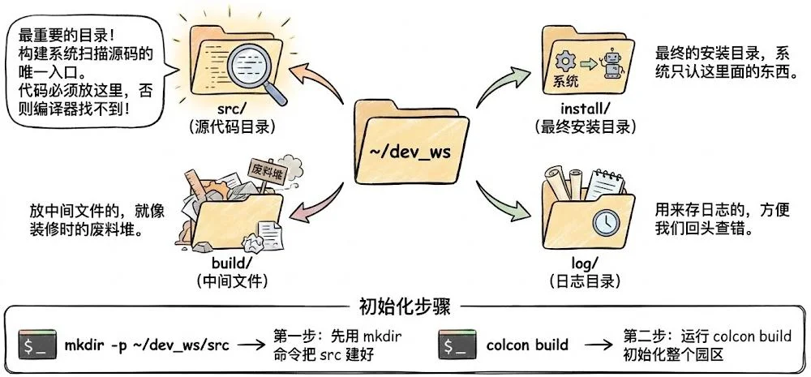
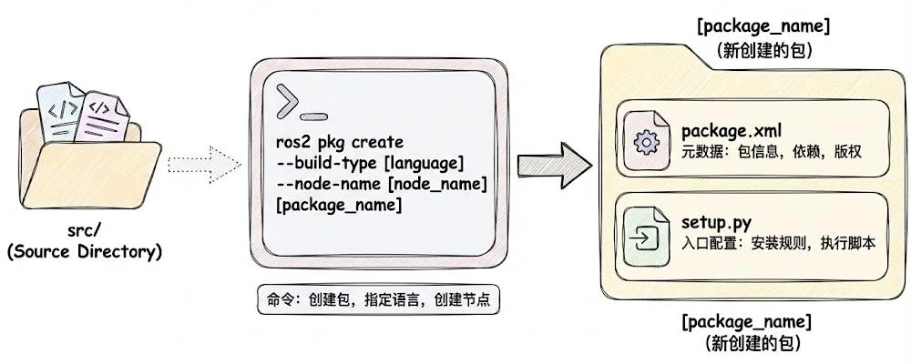
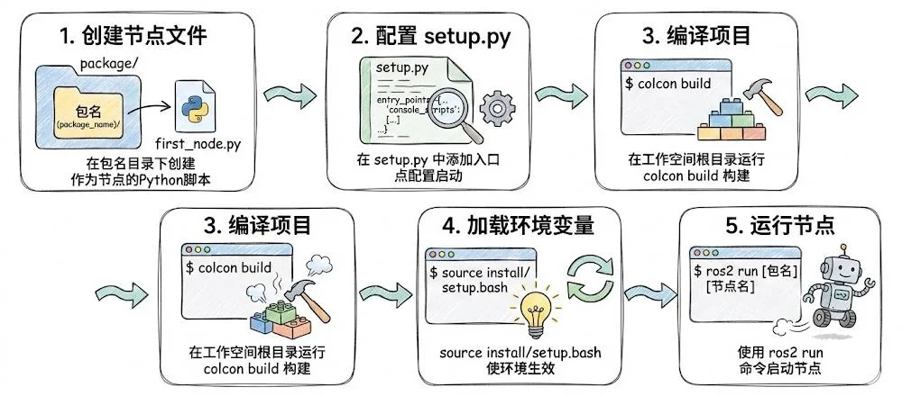
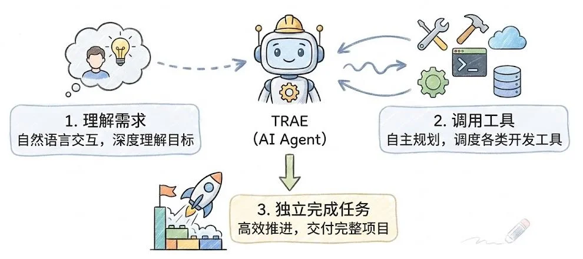
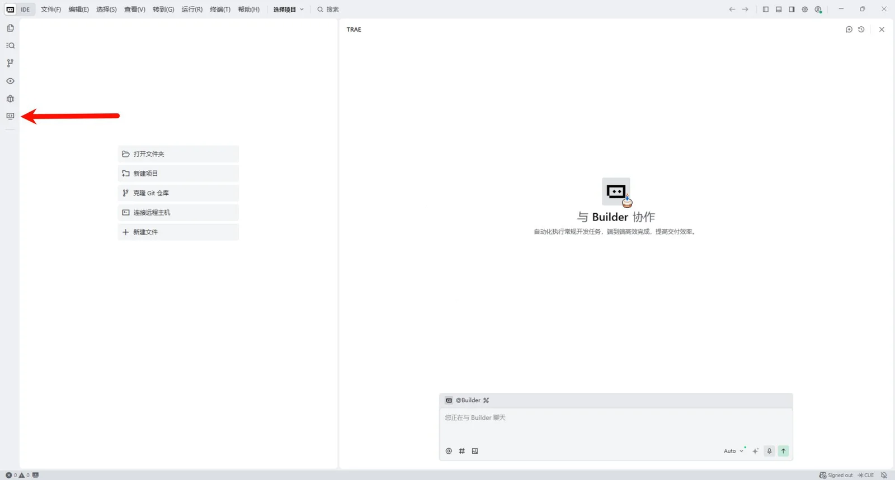
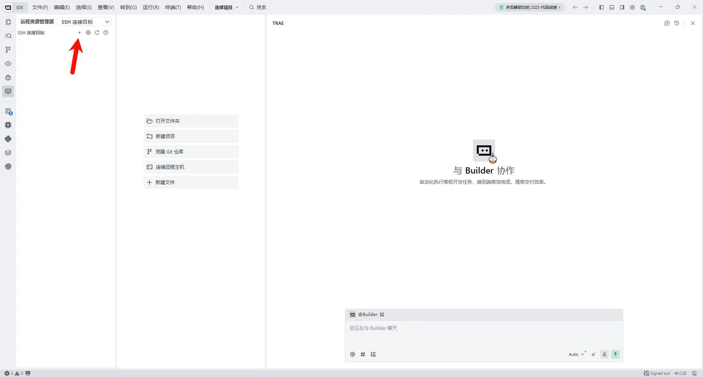

# 03 ROS 开发入门

> 从零构建 Hello World。

本章先建立三个基础概念（工作空间 / 功能包 / 节点），再动手创建包、编写并运行第一个节点，最后用 Trae 搭建远程开发环境。

## 本章地图

| 阶段             | 主题                                 |
| ---------------- | ------------------------------------ |
| 1 基础概念       | 工作空间、功能包、节点               |
| 2 工作空间与包   | 目录结构、创建包                     |
| 3 节点创建与运行 | 五步流程、`colcon build`、`ros2 run` |
| 4 IDE 开发环境   | Trae + SSH 远程开发                  |

---

## 一、基础概念

把 ROS2 项目想象成一座**工业园区**：

| 概念                      | 比喻         | 说明                                                   |
| ------------------------- | ------------ | ------------------------------------------------------ |
| **Workspace（工作空间）** | 园区 / 总部  | 项目本身，资源调度的顶层容器                           |
| **Package（功能包）**     | 独立生产车间 | 最小的分享单元，包含代码、依赖声明与编译规则           |
| **Node（节点）**          | 全职工人     | 执行具体任务的逻辑最小单元，控制/驱动/传感器逻辑的载体 |



## 二、ROS 项目开发流程

一个完整的 ROS 项目，从无到有分五步：

1. **创建工作空间** —— 圈地建园区
2. **在工作空间中创建包** —— 盖车间
3. **在包中创建节点** —— 招工人
4. **为节点提供通讯能力** —— Topic / Service / Action
5. **为节点提供业务能力** —— 实现具体的业务逻辑



## 三、工作空间与包

### 3.1 工作空间的目录结构

一个工作空间（示例 `~/dev_ws`）主要包含四个目录：

| 目录       | 作用                                                                   |
| ---------- | ---------------------------------------------------------------------- |
| `src/`     | **源码目录**，构建系统扫描的唯一入口，代码必须放这里，否则编译器找不到 |
| `build/`   | 中间文件，像装修时的废料堆                                             |
| `install/` | 最终安装目录，系统只认这里面的东西                                     |
| `log/`     | 日志目录，方便回头查错                                                 |

初始化步骤：

```bash
mkdir -p ~/dev_ws/src     # 第一步：先把 src 建好
cd ~/dev_ws
colcon build              # 第二步：初始化整个"园区"
```



### 3.2 创建功能包

在 `src/` 目录下用 `ros2 pkg create` 创建包，会自动生成 `package.xml`（元数据、依赖、版权）与 `setup.py`（入口配置、安装规则、执行脚本）：

```bash
cd src
ros2 pkg create --build-type ament_python --node-name my_node my_package
```

| 参数             | 含义                                       |
| ---------------- | ------------------------------------------ |
| `--build-type`   | 构建类型（`ament_python` / `ament_cmake`） |
| `--node-name`    | 顺带创建的同名节点                         |
| `[package_name]` | 包名                                       |



## 四、节点创建与运行（五步流程）

1. **创建节点文件**：在包目录下创建 `first_node.py`，作为节点的 Python 脚本。
2. **配置 `setup.py`**：添加入口点，声明如何启动。
3. **编译项目**：在工作空间根目录运行 `colcon build`。
4. **加载环境变量**：`source install/setup.bash`，使环境生效。
5. **运行节点**：`ros2 run [包名] [节点名]`。

```python
# setup.py
entry_points={
    'console_scripts': [
        'my_node = my_package.my_node:main',
    ],
},
```

```bash
colcon build
source install/setup.bash
ros2 run my_package my_node
```



> [!CAUTION] 别漏了 source
> 每次 `colcon build` 之后都要 `source install/setup.bash`，否则运行的还是旧代码。

## 五、IDE 开发环境：Trae

Trae 深度融合 AI 能力，是一名能够理解需求、调用工具并独立完成开发任务的"AI 开发工程师"：

1. **理解需求**：自然语言交互，深度理解目标。
2. **调用工具**：自主规划，调度各类开发工具。
3. **独立完成任务**：高效推进，交付完整项目。



### 通过 SSH 远程开发

在 Trae 左侧打开「远程资源管理器」，新增 SSH 连接目标，然后填入配置：

- 先用 `ip addr` 命令获取开发板/服务器 IP
- 输入 IP 和账号
- 最后输入 Ubuntu 登录密码




连上远程主机后，即可在本地编辑代码、远程 `colcon build` 与运行节点。

---

## 本章小结

- **三件套**：工作空间（园区）→ 功能包（车间）→ 节点（工人）。
- **目录铁律**：代码只放 `src/`，编译产物在 `build/`、`install/`、`log/`。
- **五步走**：建文件 → 配 `setup.py` → `colcon build` → `source` → `ros2 run`。
- **开发环境**：Trae 通过 SSH 远程连接，本地写码、远程运行。
