# 04 ROS2 Topic 通讯

> 构建机器人的神经系统。

本章从"机器人到底是什么"讲起，建立**发布/订阅（Pub/Sub）**的直觉，再通过小海龟 Turtlesim 跑通基本命令，最后用**六轴机械臂**和**自动驾驶 AEB**两个项目把 Topic 用到实战里。

## 本章地图

| 阶段             | 主题                                     |
| ---------------- | ---------------------------------------- |
| 一、直觉与工具   | Pub/Sub 模型、核心概念、Turtlesim 实操   |
| 二、标准开发实战 | 工作空间、第一个节点、定时器、开发五步法 |
| 三、架构进阶     | 六轴机械臂：驱动、订阅、录制回放、launch |
| 四、综合实战应用 | 自动驾驶 AEB：感知 → 决策 → 控制         |

---

## 一、直觉与工具

### 1.1 机器人是一个团队，不是一个程序

打破固有印象：机器人不是"一个巨大的单一程序"，而是**由无数独立的小人（Node，节点）组成的团队**——视觉节点负责看，决策节点负责想，运动节点负责跑。这正是工程师眼中的**微服务架构**，而 ROS 就是让它们协作的粘合剂。

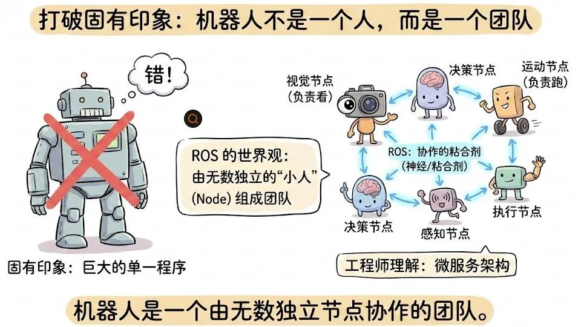

### 1.2 发布/订阅模型（Pub/Sub）

节点之间怎么交流？不是"打电话"（点对点、效率低），而是像机场塔台广播：**发布者只管发，订阅者只管收，彼此不认识**。

- **发布者（Publisher）**：塔台，把消息喊到"广播频道"。
- **话题（Topic）**：广播频道，是连接节点的通道。
- **消息（Message）**：广播的内容，例如"天气晴朗"。
- **订阅者（Subscriber）**：飞行员，调好频道就能收到，不用关心谁在播。

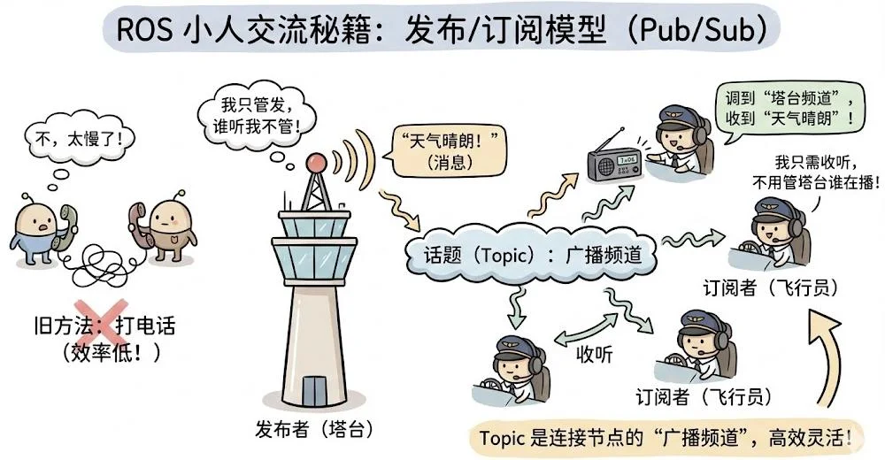

> [!TIP] 一句话记住
> Topic 是连接节点的"广播频道"，高效又灵活。

### 1.3 工业界为什么非要用 Pub/Sub

两个核心词：

- **异步（Asynchronous）**：发送者发完就走，无需等待回复。
- **解耦（Decoupling）**：双方只需约定 Topic 名字，互不认识也能协作。雷达团队只管发雷达数据，底盘团队只管收；就算把雷达换成摄像头，底盘代码一行都不用改。

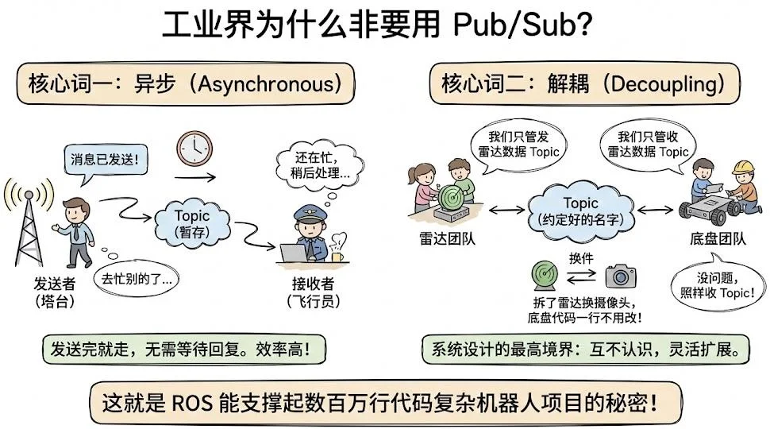

这正是 ROS 能支撑起数百万行代码的复杂机器人项目的秘密。

### 1.4 三个核心"行话"

| 概念                | 比喻           | 说明                                   |
| ------------------- | -------------- | -------------------------------------- |
| **Node（节点）**    | 干活的工人     | 执行具体任务的最小单元                 |
| **Topic（话题）**   | 输送带         | 节点之间传递数据的通道                 |
| **Message（消息）** | 输送带上的包裹 | 一次传递的实际数据，如速度、位置、指令 |

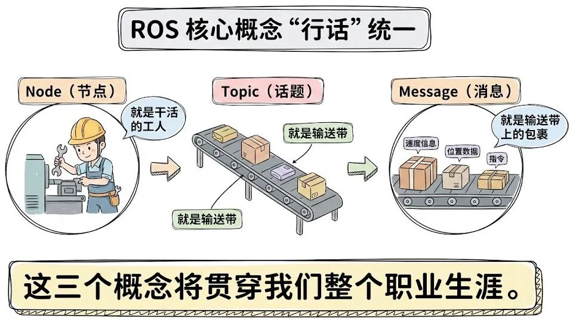

> 这三个概念将贯穿我们整个职业生涯。

### 1.5 动手：认识实验主角 Turtlesim

启动小海龟模拟器：

```bash
ros2 run turtlesim turtlesim_node
```

它本身就是一个完整的 ROS2 节点：一边**广播**自己的位置信息（Pub），一边**监听**速度指令（Sub）。

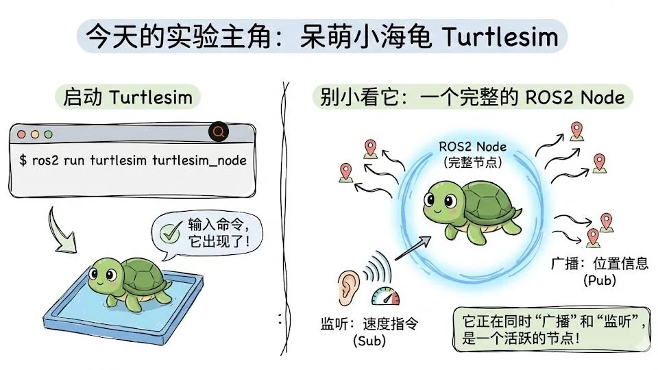

### 1.6 系统诊断三件套

像医生看病一样检查 ROS2 系统：

**第一步：查户口 —— 看有哪些话题**

```bash
ros2 topic list
```

输出里能看到 `/turtle1/pose`、`/turtle1/cmd_vel` 等频道。

**第二步：用听诊器 —— 实时查看数据流**

```bash
ros2 topic echo /turtle1/pose
```

海龟会实时汇报坐标与朝向，相当于拥有了"上帝视角"。

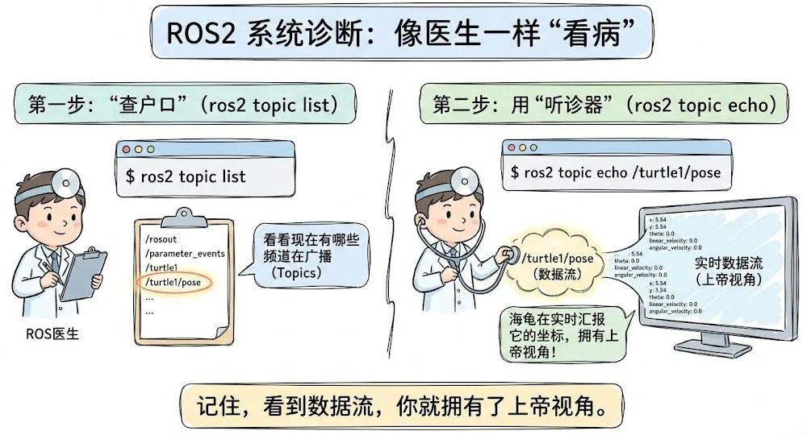

**第三步：手动接管 —— 用命令行强行发指令**

```bash
ros2 topic pub /turtle1/cmd_vel geometry_msgs/msg/Twist \
  "{linear: {x: 2.0, y: 0.0, z: 0.0}, angular: {x: 0.0, y: 0.0, z: 1.8}}"
```

回车后海龟开始转圈。在工程调试中，这是**验证电机好坏最快的方法**。

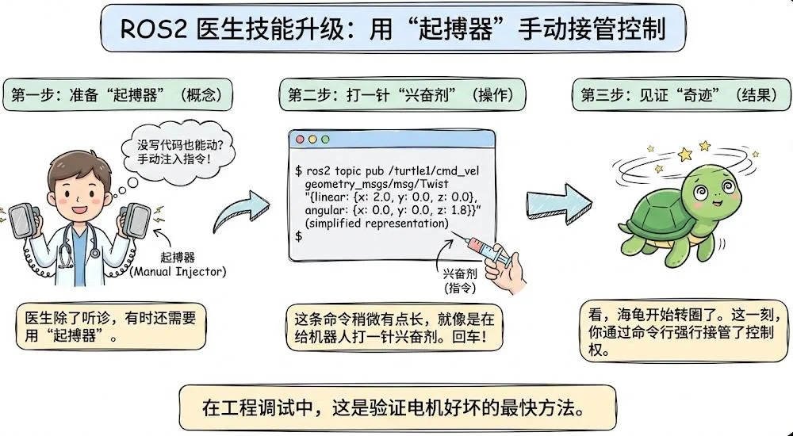

### 1.7 可视化：RQT Graph

终端里一堆文字太枯燥，`rqt_graph` 能把**节点（圆圈）**和**话题（方块）**画成一张数据流图：

```
Teleop（键盘控制节点） ──/turtle1/cmd_vel──▶ Turtlesim（海龟模拟器节点）
```

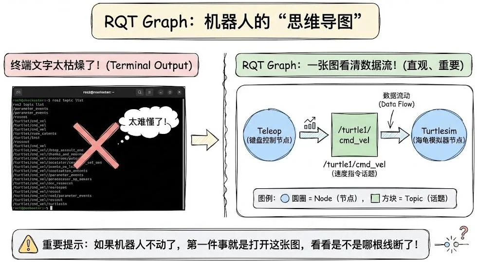

> [!WARNING] 排查第一反应
> 如果机器人不动了，第一件事就是打开这张图，看看是不是哪根线断了。

---

## 二、标准开发实战

### 2.1 工作空间与功能包

把 ROS2 代码想成做菜：

- **工作空间（Workspace）**＝"厨房"，存放所有项目的地方。
- **功能包（Package）**＝"备菜区"，具体的代码、配置、资源放在这里。

ROS2 对目录结构非常严格，包必须放在 `src/` 下：

```text
~/ros2_ws/src/my_package/   正确，ROS 能找到
~/ros2_ws/my_package/       错误，ROS 找不到
```

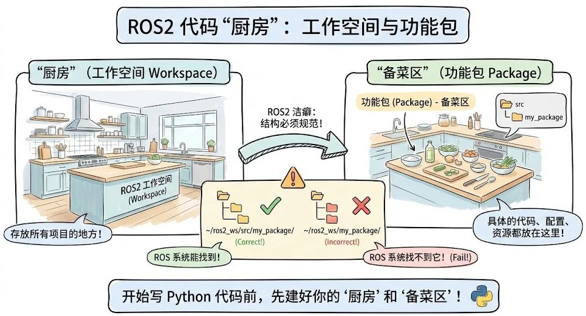

### 2.2 第一个节点：`__init__` 里的秘密

一个节点在 `__init__` 里做两件事：**注册自己** + **声明要发布的话题**。

```python
from rclpy.node import Node
from geometry_msgs.msg import Twist

class MyFirstNode(Node):
    def __init__(self):
        # 1. 告诉 ROS “我上线了”
        super().__init__('my_first_node')
        # 2. 建立发布者（广播专栏）
        self.pub = self.create_publisher(
            Twist,
            '/turtle1/cmd_vel',
            10                 # 队列长度
        )
```

就像在广播站注册了一个专栏，准备好大声广播。

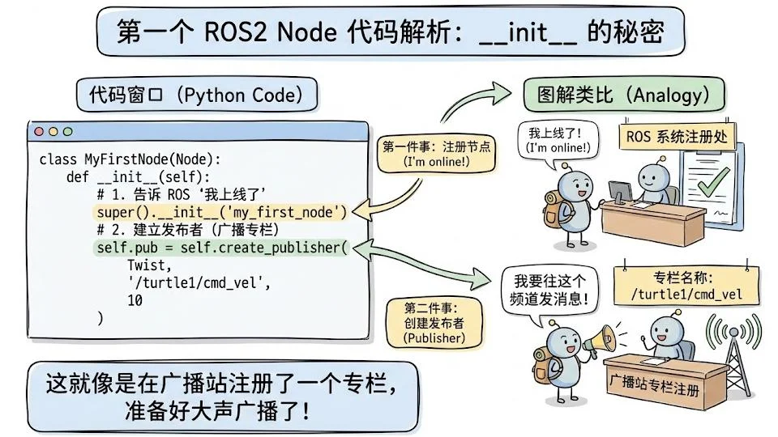

### 2.3 编程灵魂：定时器回调（Timer Callback）

不要用 `while` 循环"忙等待"检查时间——那会一直占用 CPU。ROS 的做法是**事件驱动**：定时器 0.5 秒"叫醒"你一次，你处理完就继续睡。

```python
# 唤醒 -> 打包消息 -> 发送 -> 继续睡
self.timer = self.create_timer(0.5, self.callback)
```

| 传统思维             | ROS 之道                   |
| -------------------- | -------------------------- |
| `while` 循环，忙等待 | 事件驱动，Sleep & Wait     |
| 效率低，占用 CPU     | 不占用 CPU，需要时才被叫醒 |

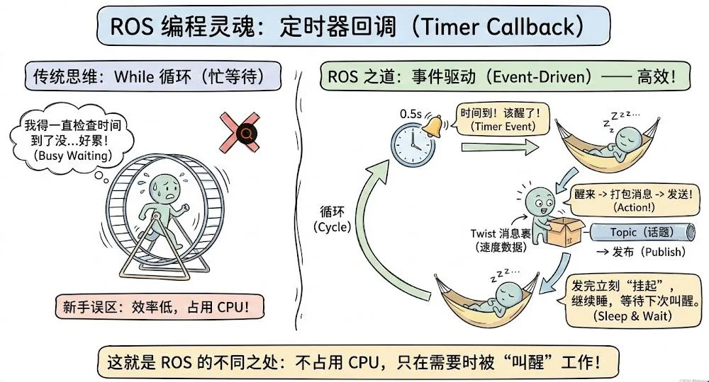

### 2.4 开发五步法

十年经验总结的开发流程，**Config 和 Source 千万别忘**：

| 步骤 | 名称                   | 说明               | 对应命令                    |
| ---- | ---------------------- | ------------------ | --------------------------- |
| 1    | Create（创建包）       | 打地基，建新家     | `ros2 pkg create ...`       |
| 2    | Code（写代码）         | 写脚本，赋灵魂     | Python / C++                |
| 3    | **Config（配置）**     | 办户口，登记入口点 | 编辑 `setup.py`             |
| 4    | Build（编译）          | 照图纸，造实体     | `colcon build`              |
| 5    | **Source（刷新环境）** | 通电源，激活它     | `source install/setup.bash` |

> [!CAUTION] 90% 的调试时间都坑在这里
> 改了代码却忘了 `source`，节点还是旧行为。务必把这一步刻在脑子里。

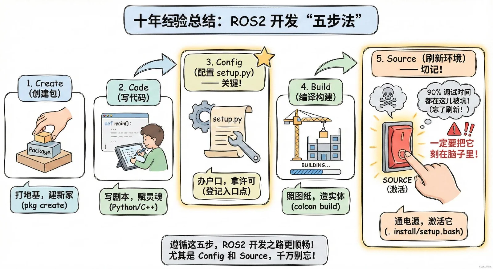

配置入口点在 `setup.py`：

```python
entry_points={
    'console_scripts': [
        'my_node = my_package.my_node:main',
    ],
},
```

### 2.5 小海龟速度控制：线速度与角速度

海龟的运动由话题 `/turtle1/cmd_vel` 上的 `Twist` 消息控制：

- **线速度 Linear（x）**：前进/后退。
- **角速度 Angular（z）**：原地左转/右转。

坐标接口约定：**原点在左下角 (0,0)，X 轴向右，Y 轴向上**。

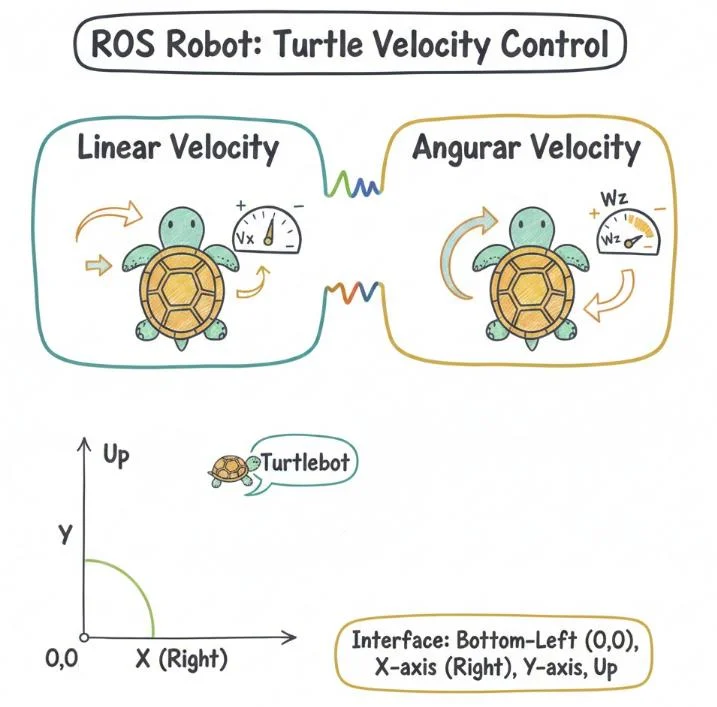

自己写一个带 GUI 的控制器，就能实时看到坐标与速度反馈：

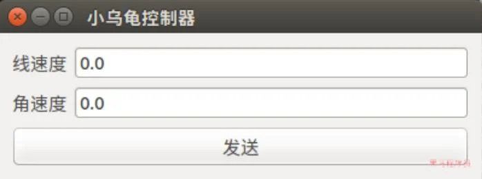
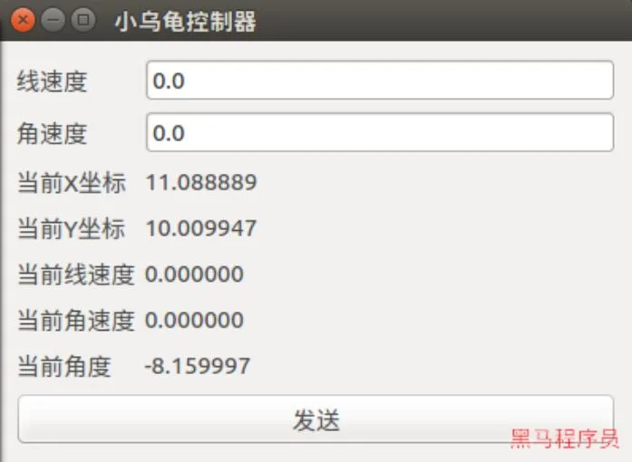
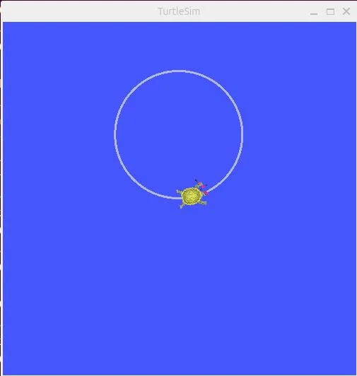

### 2.6 数据流回顾

| 方向     | 话题      | 数据           | 作用         |
| -------- | --------- | -------------- | ------------ |
| **订阅** | `cmd_vel` | 线速度、角速度 | 让海龟动起来 |
| **发布** | `pose`    | X、Y、Theta    | 实时位置反馈 |

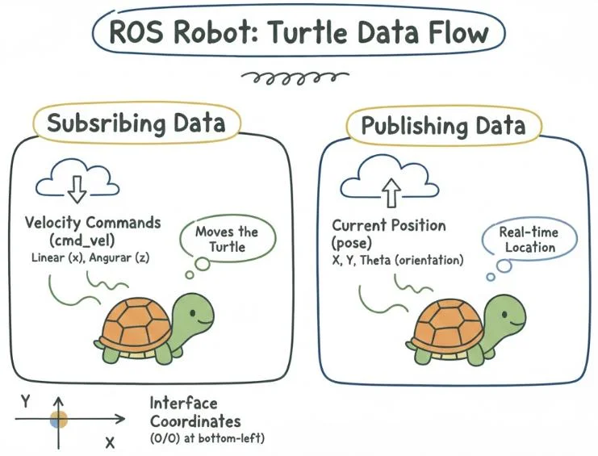

---

## 三、架构进阶：六轴机械臂

### 3.1 项目主角：控制与反馈

六轴机械臂是典型的"执行 + 反馈"系统：

- **驱动部分（执行器）**：控制 6 个关节，运动到指定角度。
- **传感部分（编码器）**：实时读取关节角度，提供位置反馈。
- **通信**：与上位机通过串口（UART/USB）通信。

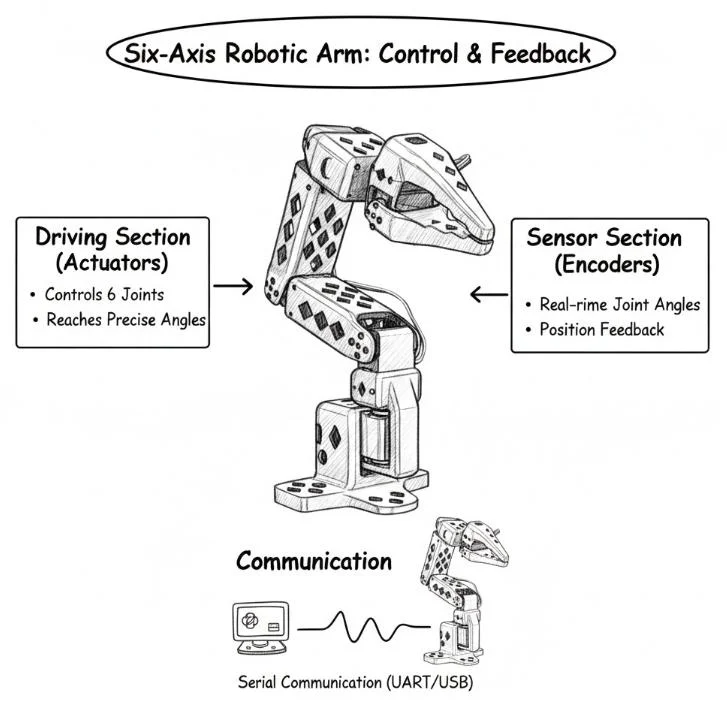
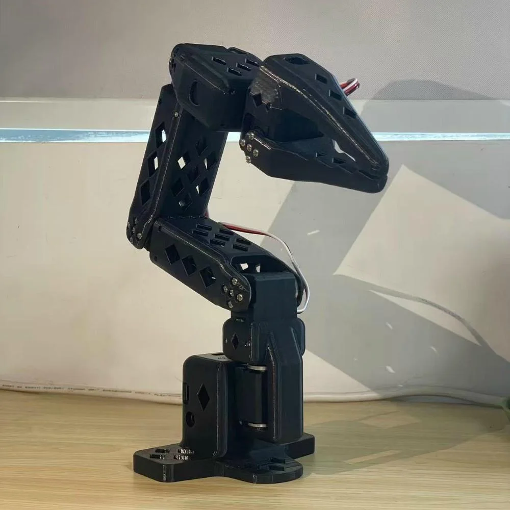

### 3.2 需求一：遥操作，实时发布关节角

**背景**：手动摇动机械臂时，实时把关节角度发布出去。

**流程**：创建节点 → 读取关节角 → 自定义消息 → 发布消息 → 测试。

使用手柄遥操作，节点读取 6 个关节角（J1–J6），以 `/joint_states` 话题发布出去。

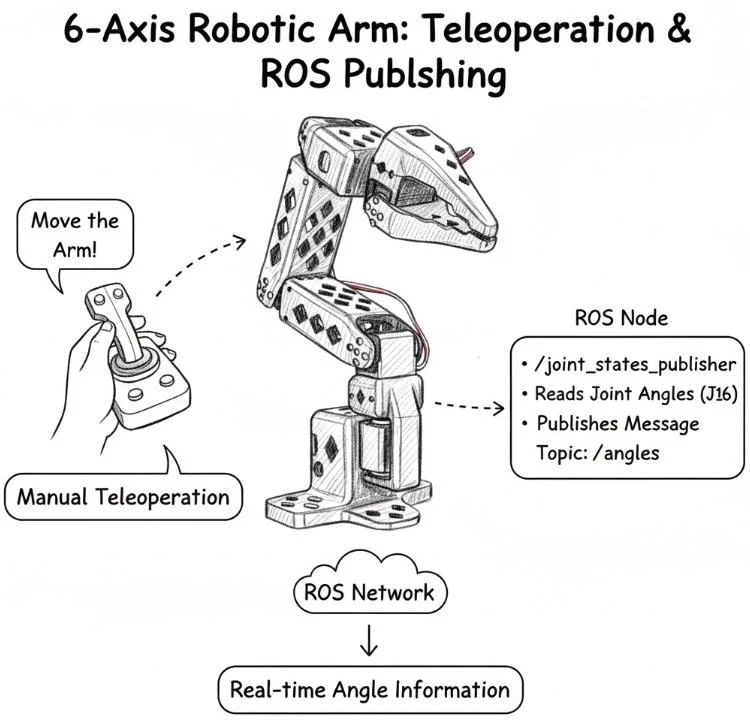
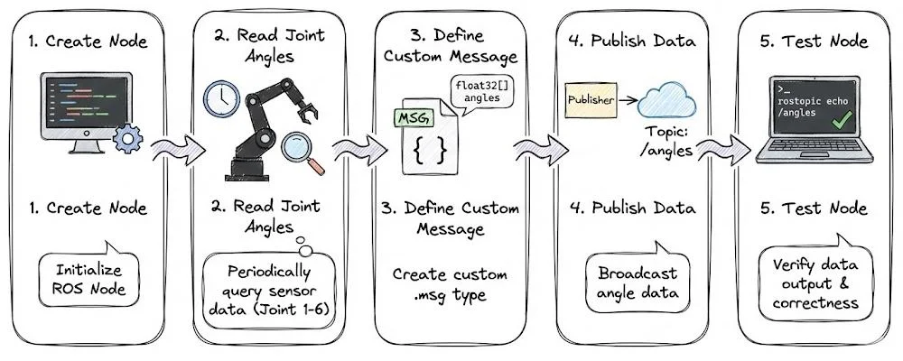

### 3.3 需求二：订阅角度，驱动关节

**背景**：订阅其他节点发送的角度，让机械臂运动到指定角度。

控制节点把目标角度发布到 `/cmd_angles`（类型 `float32[]`），机械臂控制节点 `/arm_controller` 订阅后驱动 J1–J6 运动。

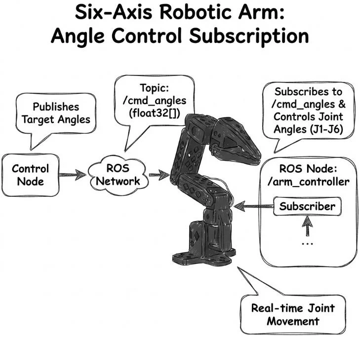
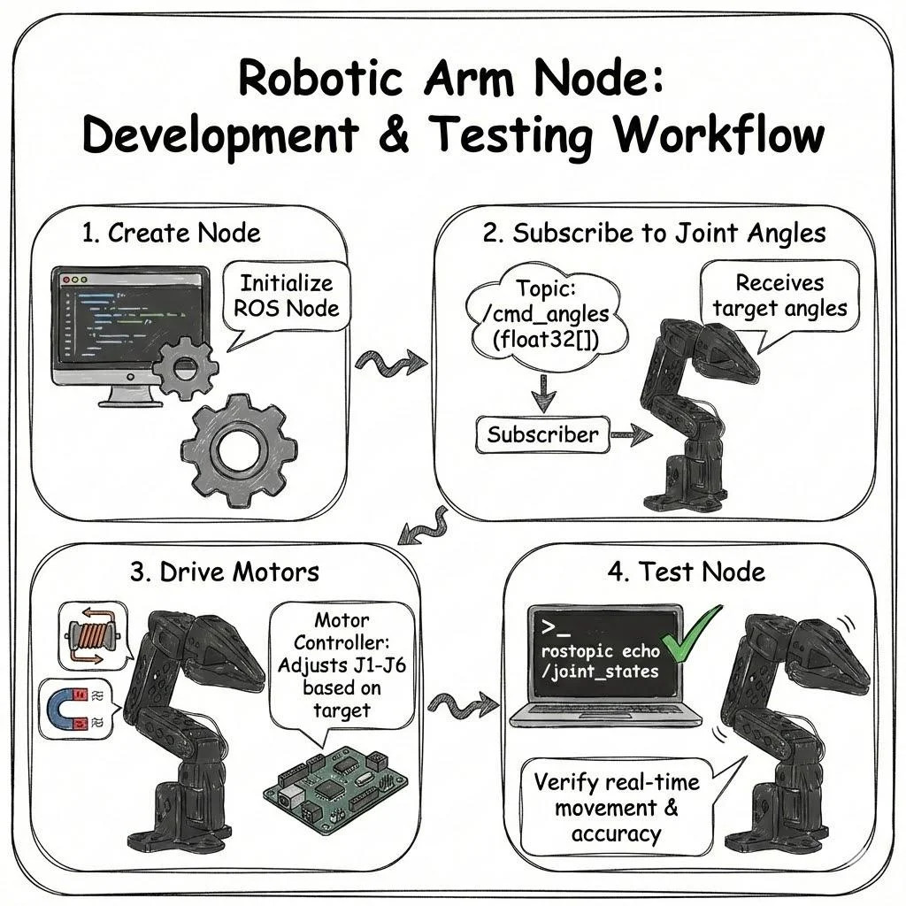

> [!NOTE] 节点分工
> **驱动节点**负责关节控制与反馈；**逻辑节点**负责上层业务（如录制、回放）。两者通过 `/joint_states` 与 `/cmd_angles` 两个话题连接。

### 3.4 需求三：动作录制与回放

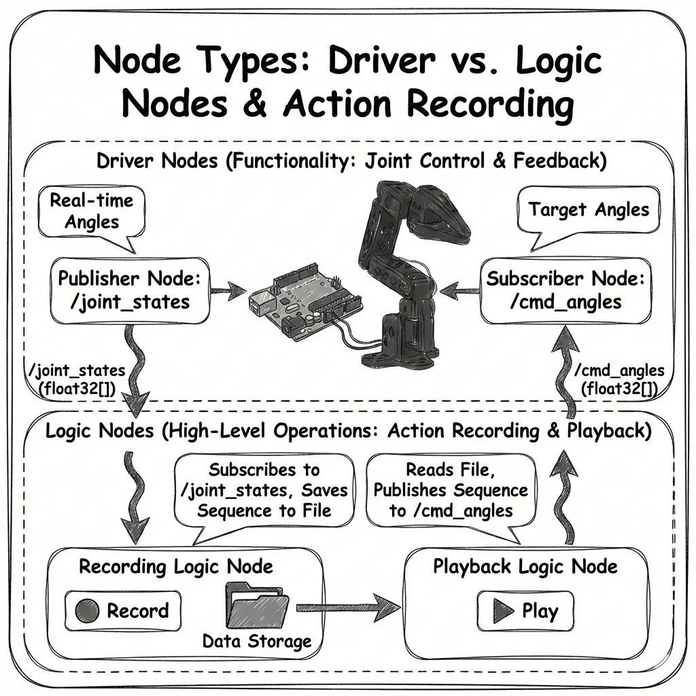

**录制流程**：创建节点 → 订阅关节角 → 存储时间+角度信息 → 提供启停接口。

- 订阅 `/joint_states`（关节角）
- 把**时间戳 + 角度**存入文件/数据库
- 通过 `ros2 service call /start_record` 或按钮控制启停

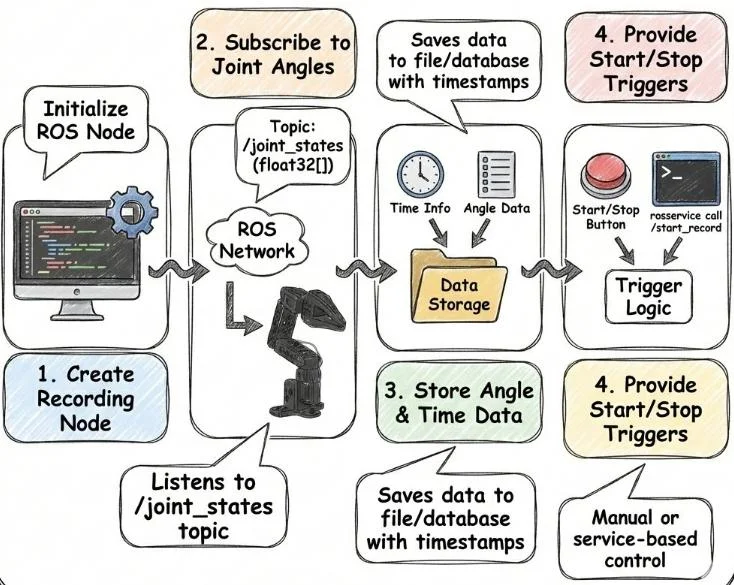

**回放流程**：创建节点 → 读取解析文件 → 按时间播放 → 启停操作。

- 读取文件，按时间顺序解析
- 按时间轴发布到 `/cmd_angles`
- 通过 `ros2 service call /start_playback` 控制

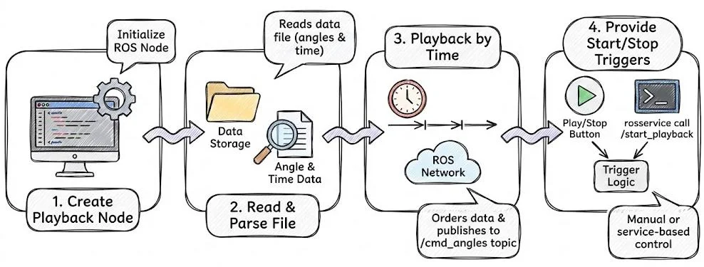

### 3.5 功能整合与分层架构

把录制和回放合并到一个节点 `arm_record_playback_node`，对外只暴露一个服务 `/control_record_playback`，避免功能冲突。

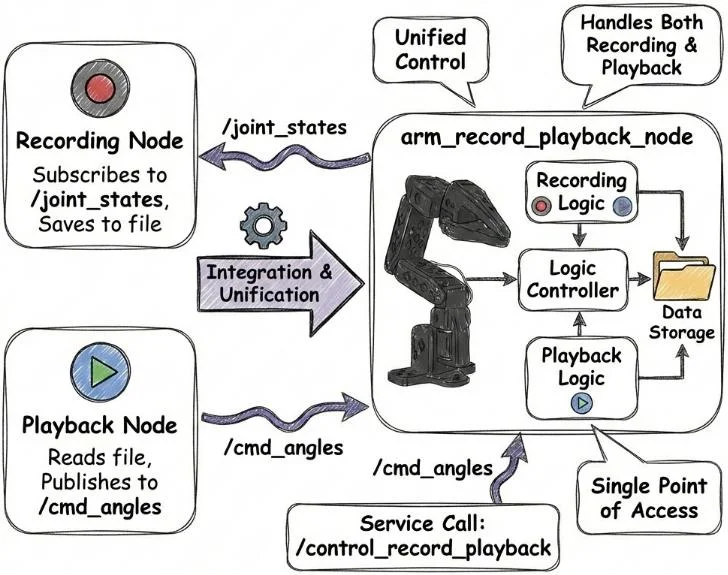

再叠加 UI，形成分层架构：

| 层     | 节点                       | 职责                                  |
| ------ | -------------------------- | ------------------------------------- |
| UI 层  | `gui_record_playback_node` | 用户交互，通过 `/ui_control` 服务控制 |
| 逻辑层 | `arm_record_playback_node` | 录制回放业务逻辑 + 数据存储           |
| 驱动层 | `arm_joint_node`           | 控制电机、读取传感器（实时控制）      |

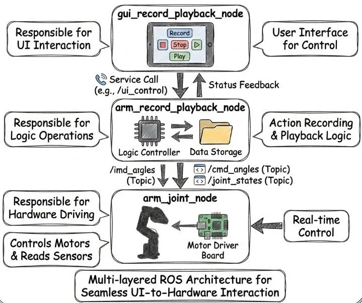

### 3.6 launch 一键启动

手动开三个终端分别 `ros2 run` 太麻烦，用 launch 文件一次启动所有节点：

```xml
<launch>
  <node name="arm_joint_node" .../>
  <node name="arm_record_playback_node" .../>
  <node name="gui_record_playback_node" .../>
</launch>
```

```bash
ros2 launch pkg system.launch
```

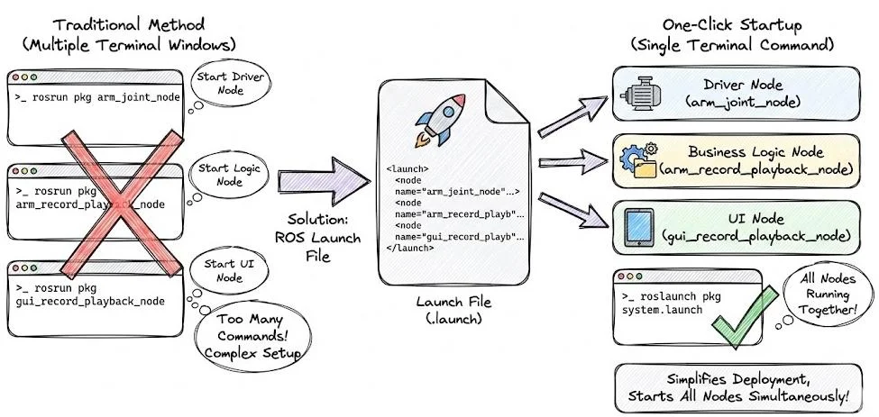

## 四、综合实战应用：自动驾驶 AEB

### 4.1 给海龟装上"翻译"

问题：海龟只吐原始坐标 `(x: 5.5, y: 5.5)`，而 AEB 工程师只想知道"前面还有几米、会不会撞"。

解决方案：在两者之间加一层**翻译节点（Translator Node）**，把坐标换算成**距离**和**风险**。

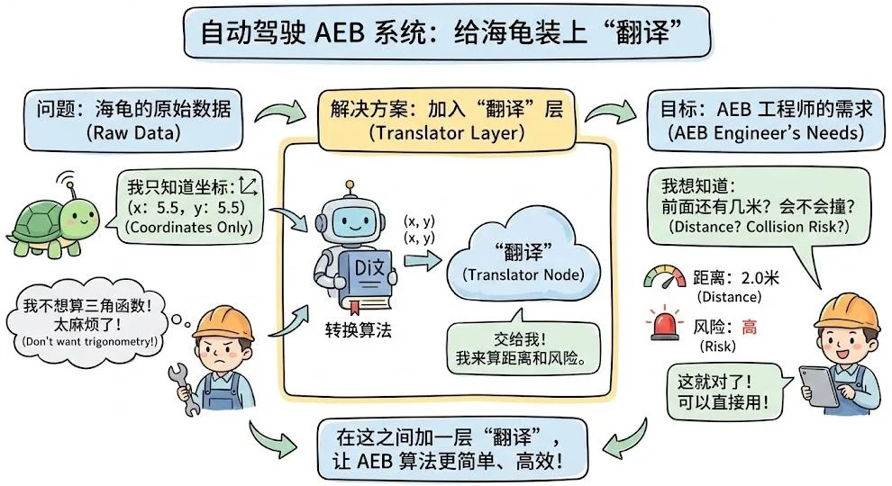

### 4.2 自定义 Msg：接口契约

感知组和控制组约定一个消息格式 `RadarScan.msg`，这就是**接口契约**——只要消息符合契约，双方就能协作，无需关心对方代码实现。

```text
# RadarScan.msg
float32 distance      # 距离
bool    risk_warning  # 是否危险
```

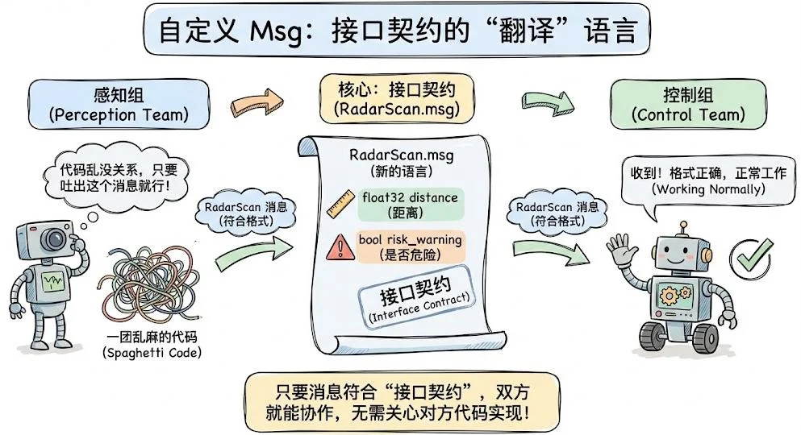

### 4.3 编译与验收

自定义消息底层依赖 C++ 工具链，所以要在 `CMakeLists.txt` 里注册（标准流程，照抄即可）。

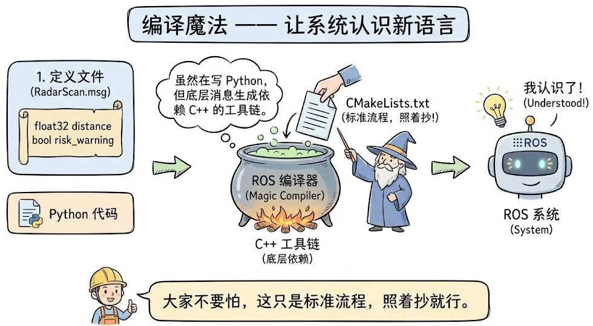

编译完成后验证：

```bash
ros2 interface show <your_msg_name>
```

能看到 `float32 distance` 和 `bool risk_warning` 就说明成功——你刚刚创造了属于这台机器人的"方言"。

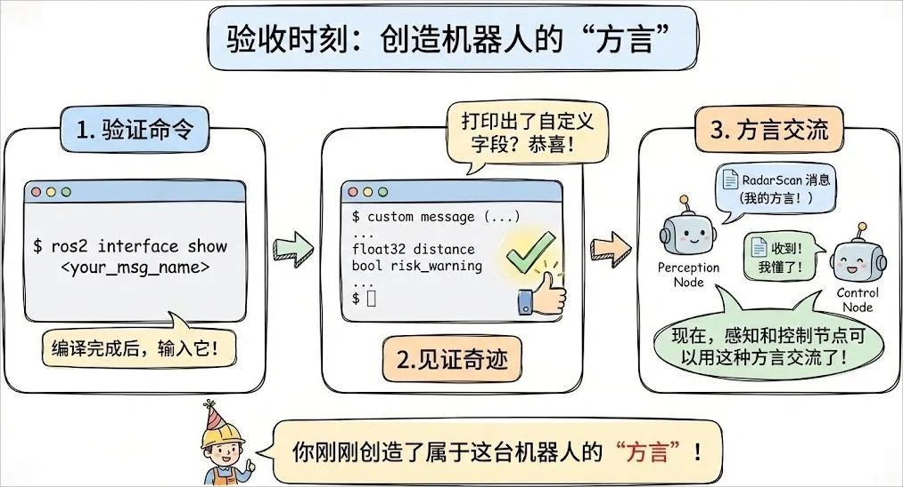

### 4.4 三层架构：感知 → 决策 → 控制

| 层       | 角色     | 说明                                  |
| -------- | -------- | ------------------------------------- |
| **感知** | 数据源头 | 模拟器 → 雷达节点，清洗与翻译原始信息 |
| **决策** | 智能中枢 | AEB 节点，分析风险、制定策略          |
| **控制** | 执行动作 | 输出控制指令，紧急制动                |

这正是特斯拉、Waymo 等自动驾驶公司架构的雏形。

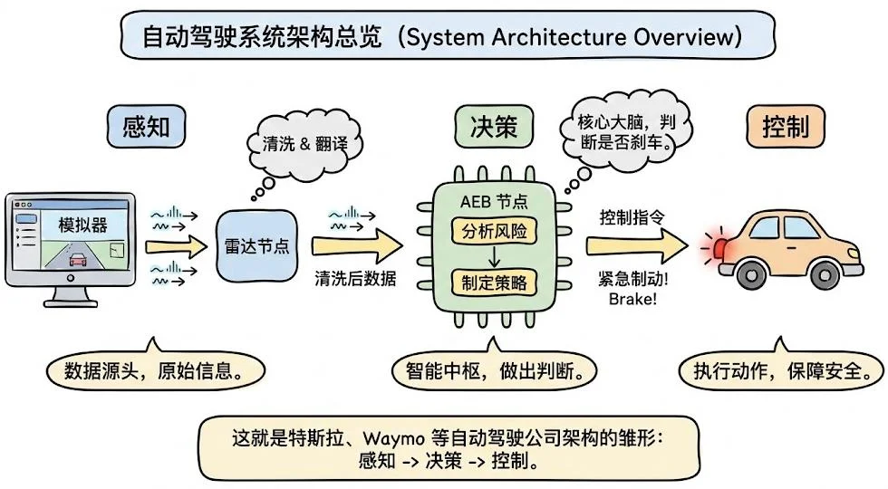

### 4.5 感知层：数据抽象与语义提取

**数据抽象**：墙在 11 米处，海龟当前位置 x，则距离 = 11 − x。

```python
distance = 11.0 - msg.x
```

**语义提取**：距离小于 2 米时，把冰冷的数字变成判断。

```python
risk_warning = True   # 有危险！
```

> [!IMPORTANT] 单一职责原则
> 感知层只负责喊"有危险"，**不负责踩刹车**。一定要管住自己的手。

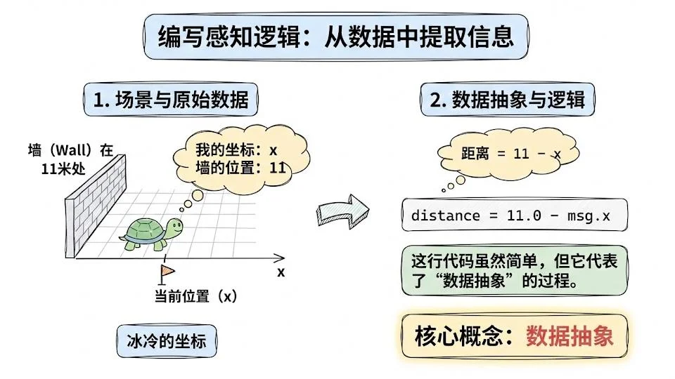
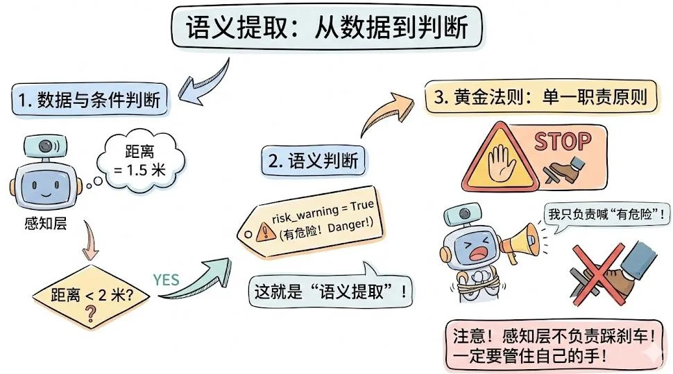

写完感知层，**先测试再前进**：运行节点、监听 `/radar_scan`，检查距离是否变小、`True` 是否在 2 米以内出现。

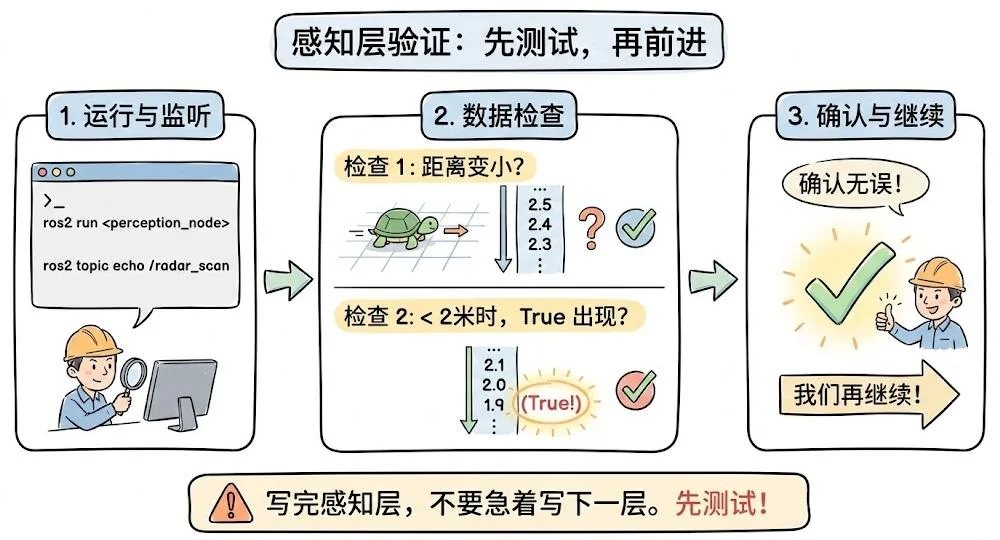

### 4.6 决策层：盲目信任与解耦精髓

决策层是一个"盲人"——它看不见海龟在哪，只**完全信任**雷达发来的消息。这种"盲目信任"正是解耦的精髓：**只关注消息本身，无需知晓对方是谁或如何工作**。

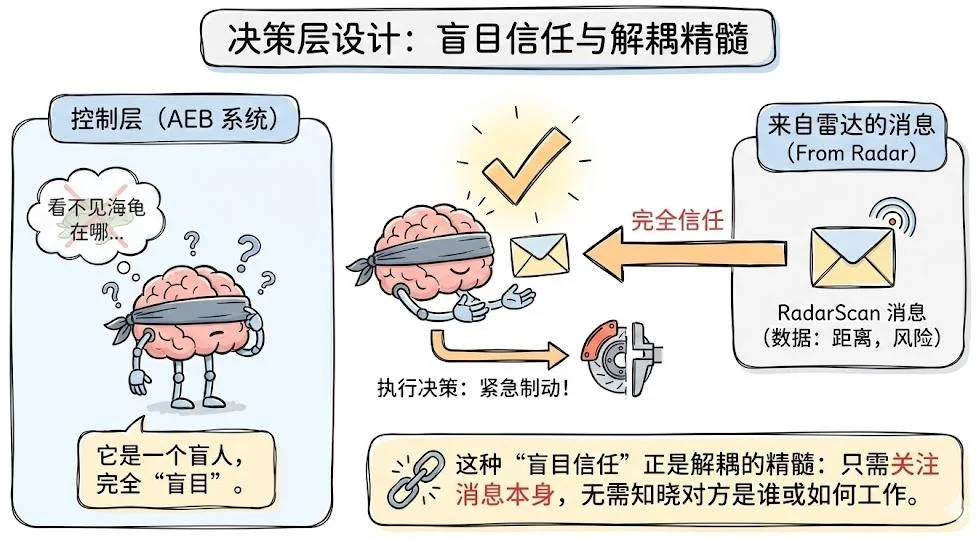

### 4.7 控制层：系统的大脑

没有任何复杂的计算，只有最纯粹的逻辑判断：

```python
if warning is True:
    speed = 0     # 刹车
else:
    speed = 1     # 巡航
```

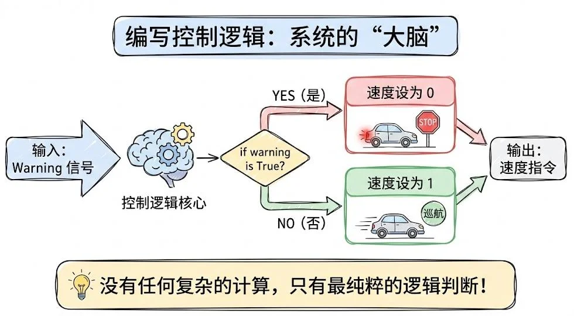

### 4.8 最终联调 Demo

1. 依次启动：模拟器、雷达节点、AEB 节点
2. 海龟接近墙壁：3 米 → 2 米……
3. 在 2 米处成功制动，毫厘不差

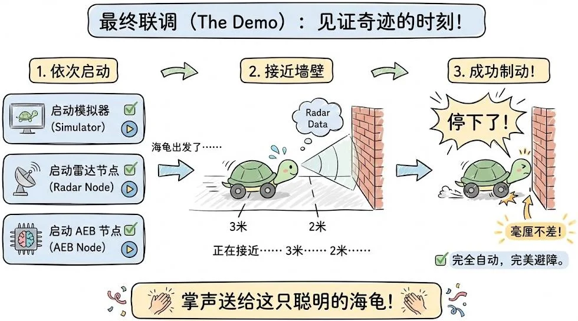

### 4.9 总结与展望

从一只"只会乱跑的海龟"，到具备自动避障功能的智能机器人，靠的是四块拼图：

1. 海龟（原始能力）
2. **ROS2 Topic 机制**（Pub/Sub）
3. **自定义消息**（接口设计）
4. **分层架构**（感知 → 决策 → 控制）

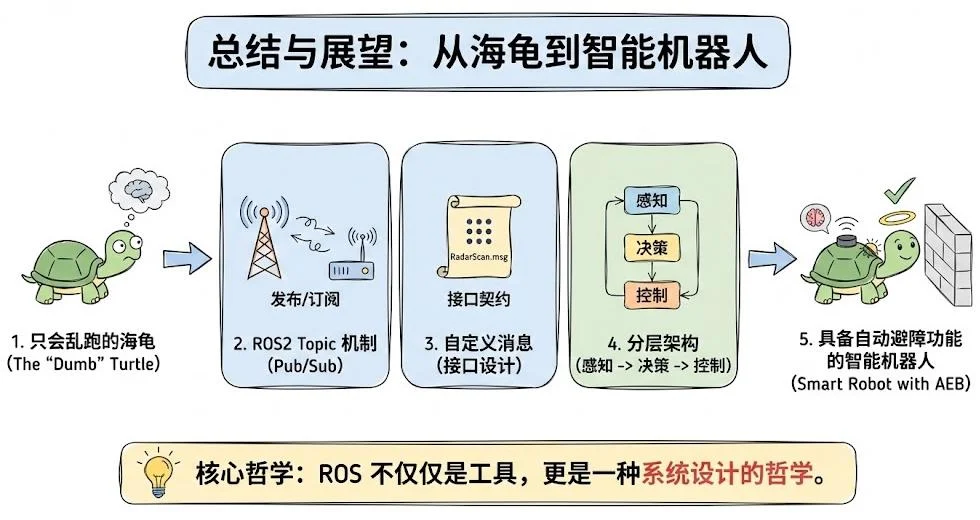

> [!TIP] 核心哲学
> ROS 不仅仅是工具，更是一种**系统设计的哲学**。

---

## 本章小结

- **模型**：Pub/Sub 三个概念——Node 干活、Topic 传话、Message 是内容。
- **诊断**：`ros2 topic list / echo / pub` 三件套，配上 `rqt_graph` 看图。
- **五步法**：Create → Code → **Config** → Build → **Source**，后两步最容易忘。
- **架构**：驱动节点管实时控制，逻辑节点管业务；录制/回放靠服务启停。
- **实战**：AEB 分三层——感知出语义、决策只信任消息、控制只做判断。

---

## 命令速查

| 命令                                   | 作用                     |
| -------------------------------------- | ------------------------ |
| `ros2 run <pkg> <node>`                | 运行节点                 |
| `ros2 topic list`                      | 列出所有话题             |
| `ros2 topic echo <topic>`              | 实时打印话题数据         |
| `ros2 topic pub <topic> <type> <data>` | 从命令行发布消息         |
| `ros2 interface show <msg>`            | 查看消息/接口定义        |
| `rqt_graph`                            | 可视化节点与话题的数据流 |
| `colcon build`                         | 编译工作空间             |
| `source install/setup.bash`            | 刷新环境变量             |
| `ros2 launch <pkg> <file.launch>`      | 一键启动多个节点         |
| `ros2 service call /start_record`      | 服务调用（录制启停）     |

---
