# 06 ROS 语音 & AI 与控制

> 为机器装上嘴巴和耳朵，为机器装上智能辅助系统。

本章打通"听 → 理解 → 行动"的链路：先用 VAD/ASR/TTS 让机器人能听会说，再理解大语言模型的原理与调用，然后用 MCP 协议把大模型和硬件连接起来，最后集成到 ROS。

## 本章地图

| 阶段           | 主题                                          |
| -------------- | --------------------------------------------- |
| 1 语音的听和说 | VAD / ASR / TTS、音频数字化、PyAudio、Whisper |
| 2 大语言模型   | Embedding、概率预测、自回归、API 调用         |
| 3 MCP 服务     | Model Context Protocol、MCP Server 实战       |
| 4 ROS 集成     | MCP-to-Topic 桥接、机械臂控制                 |

---

## 一、语音的听和说

### 1.1 机器人为什么需要"能听会说"

一条完整的语音链路，就像给机器人装上了耳朵和嘴巴：

```
麦克风 → 1. VAD（语音活动检测）→ 2. ASR（语音识别，音频→文本）
      → 3. LLM（大脑，理解并生成回复）→ 4. TTS（语音合成，文本→音频）→ 扬声器
```

- **VAD**：判断是否有人在说话。
- **ASR**：把音频转成文本。
- **LLM**：理解文本、生成回复。
- **TTS**：把文本合成为语音。

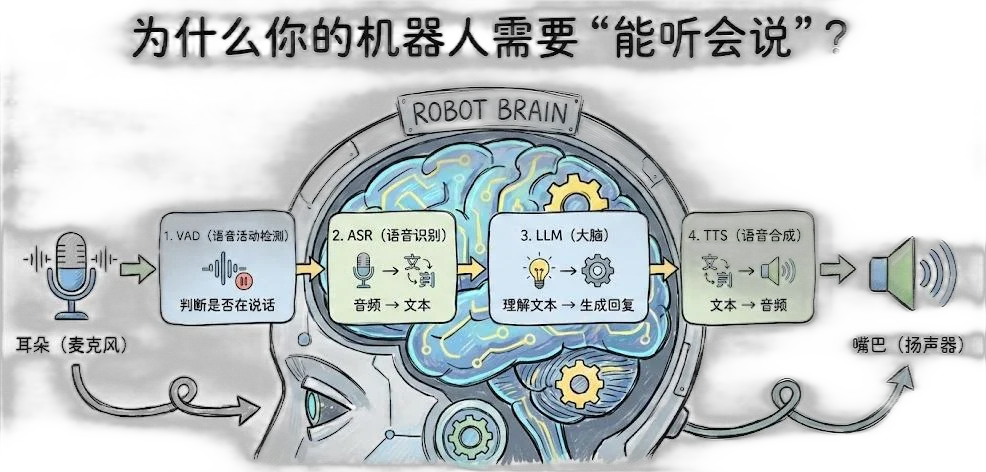

### 1.2 为什么要 VUI：交互的进化

| 接口                | 特点           |
| ------------------- | -------------- |
| **CLI（命令行）**   | 精确但门槛高   |
| **GUI（图形界面）** | 直观但需接触   |
| **VUI（语音界面）** | 自然、双手释放 |

> 具身智能的核心，是像人一样与物理世界交互。

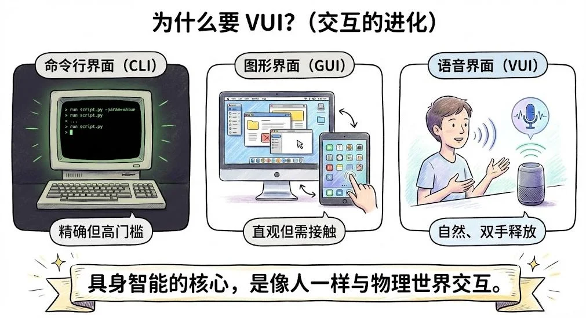

### 1.3 全链路架构（The Loop）

一个闭环由五步构成：**Audio Input → ASR → LLM Brain → TTS → Audio Output**，然后回到输入，循环往复。

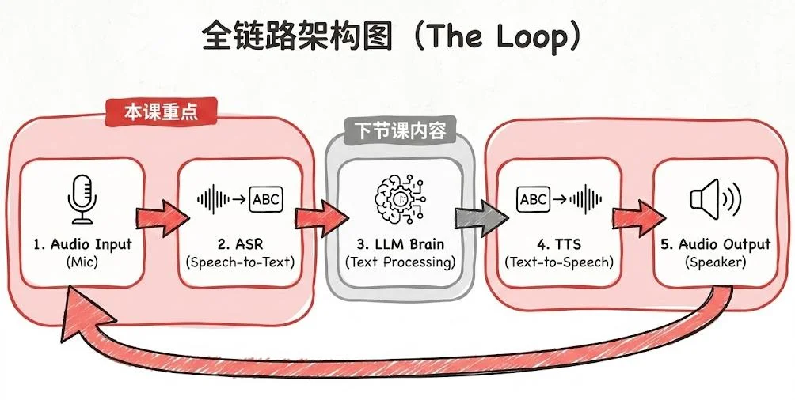

### 1.4 声音的数字化（ADC 原理）

模拟信号经过**采样（Sampling）**与**量化（Quantization）**变成数字信号。

> 数据量 ＝ 采样率 × 量化精度 × 声道数

| 参数                  | 常见取值                                |
| --------------------- | --------------------------------------- |
| Sample Rate（采样率） | 16000Hz（标准语音）、44100Hz（CD 音质） |
| Channels（声道）      | Mono 单声道、Stereo 立体声              |

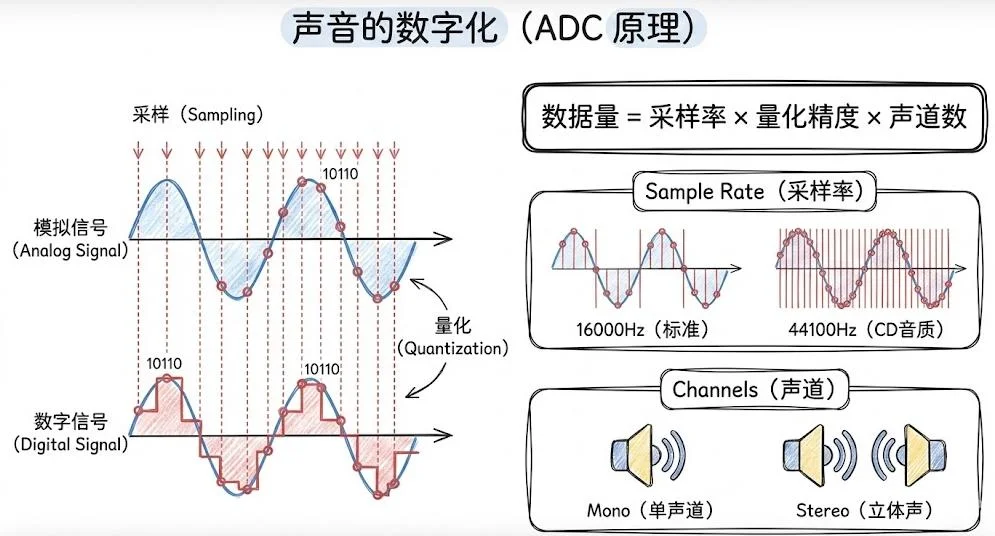

### 1.5 Python 录音实战（PyAudio）

用"水流模型"理解录音：麦克风是水龙头，`Chunk Buffer` 是接水的杯子，WAV 文件是最后的水缸。

```python
import pyaudio
import wave

CHUNK = 1024
FORMAT = pyaudio.paInt16
CHANNELS = 1
RATE = 16000

RECORD_SECONDS = 5
WAVE_OUTPUT_FILENAME = "output.wav"
```

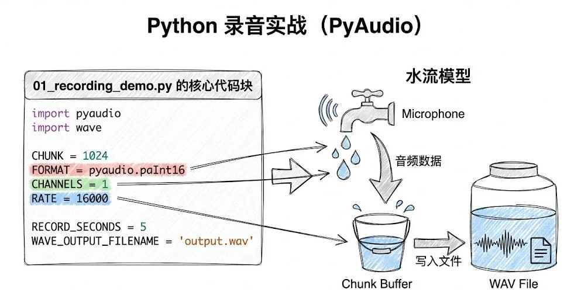

### 1.6 环境配置避坑指南

`ModuleNotFoundError: No module named 'pyaudio'` 是常见坑：

| 平台    | 解决方式                           |
| ------- | ---------------------------------- |
| Windows | 下载对应 `.whl` 文件离线安装       |
| Linux   | `sudo apt install portaudio19-dev` |
| macOS   | `brew install portaudio`           |
| 万能法  | `conda install`                    |

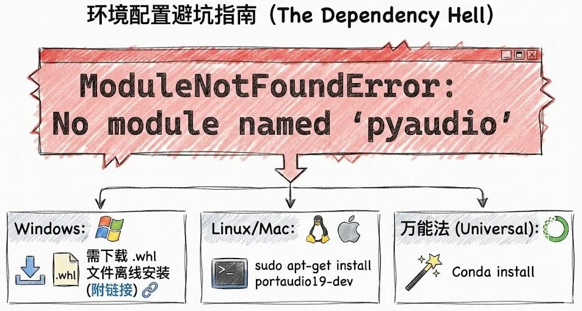

### 1.7 机器是如何"听懂"的：声谱图

WAV 文件先转成**声谱图（Spectrogram）**——一张花花绿绿的图，再用 **CNN / Transformer** 模型识别，输出文字。

> 机器听到的不是声音，而是看到了声音的"图像"。

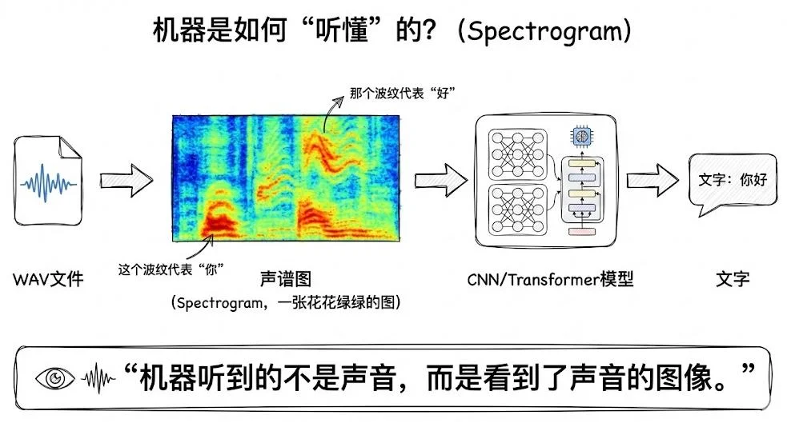

### 1.8 技术选型：在线 vs 离线

| 方案              | 代表                  | 优点               | 缺点               |
| ----------------- | --------------------- | ------------------ | ------------------ |
| **在线（Cloud）** | 通义听悟 / Google API | 高精度、可分角色   | 需联网、隐私风险   |
| **离线（Local）** | OpenAI Whisper        | 隐私安全、断网可用 | 吃算力、占本地资源 |

场景推荐：会议纪要工具用**在线 API**，家庭陪护机器人用**离线模型**。

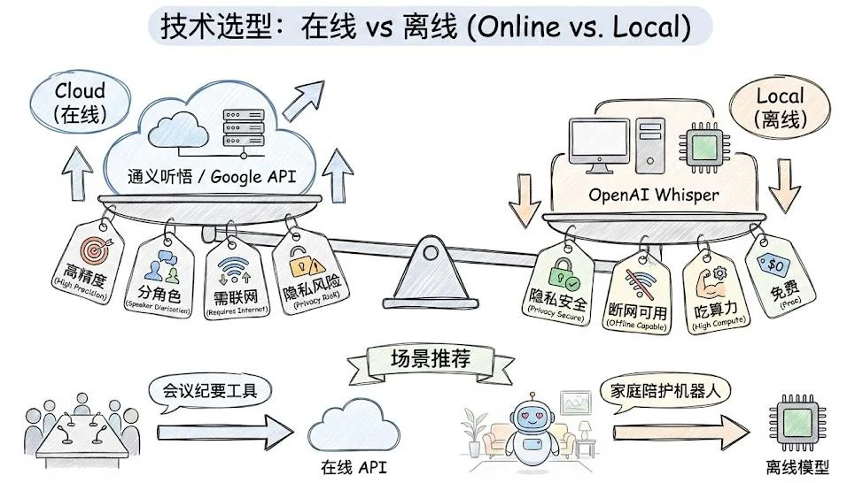

### 1.9 Whisper 实战与 FP16 报错修复

```python
model = whisper.load_model("base")
result = model.transcribe("output.wav")
print(result["text"])
```

老旧 CPU 不支持 FP16，会报 `LayerNormKernelImpl not implemented for 'Half'`。解决：告诉模型用 FP32 慢慢算。

```python
result = model.transcribe("output.wav", fp16=False)
```

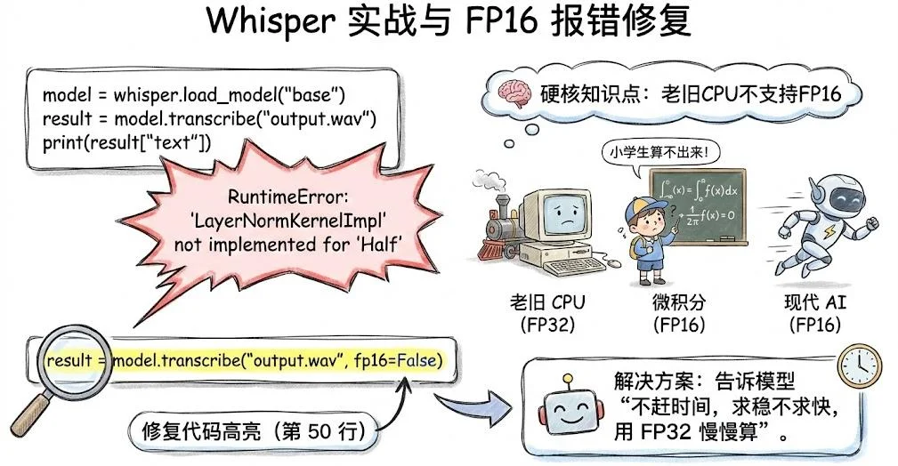

### 1.10 TTS 的技术进化

| 级别    | 方式           | 特点           |
| ------- | -------------- | -------------- |
| Level 1 | 拼接合成       | 机械、断裂感强 |
| Level 2 | 统计参数合成   | 流畅但平淡     |
| Level 3 | 端到端神经合成 | 情感丰富、拟人 |

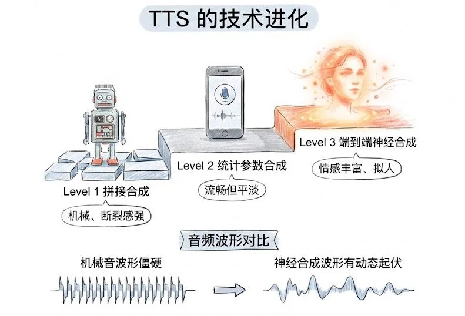

### 1.11 离线与在线 TTS 实战

```python
# 离线 TTS：pyttsx3
import pyttsx3
engine = pyttsx3.init()
engine.say("hello")
engine.runAndWait()

# 在线 TTS：Edge-TTS
import edge_tts
communicate = edge_tts.Communicate("你好，世界")
await communicate.save("out.mp3")
```

| 方案            | 优点           | 建议场景 |
| --------------- | -------------- | -------- |
| 离线 `pyttsx3`  | 离线、快速     | 报警指令 |
| 在线 `Edge-TTS` | 微软引擎、自然 | 闲聊对话 |

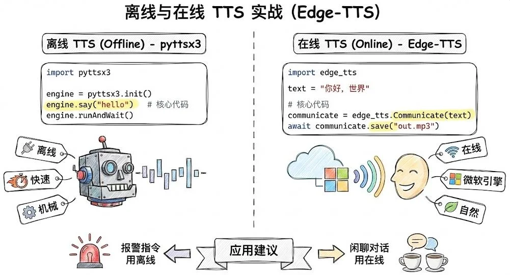

---

## 二、大语言模型

### 2.1 AI 为什么能听懂你的话

从 V4 版"玩具"代码（`{code: "hello"}`）到大模型原理，核心要掌握三件事：

- 理解传统音箱的"智障"原因：**规则匹配**
- 掌握大模型核心：**Embedding（词向量）**
- 掌握大模型机制：**概率预测（文字接龙）**

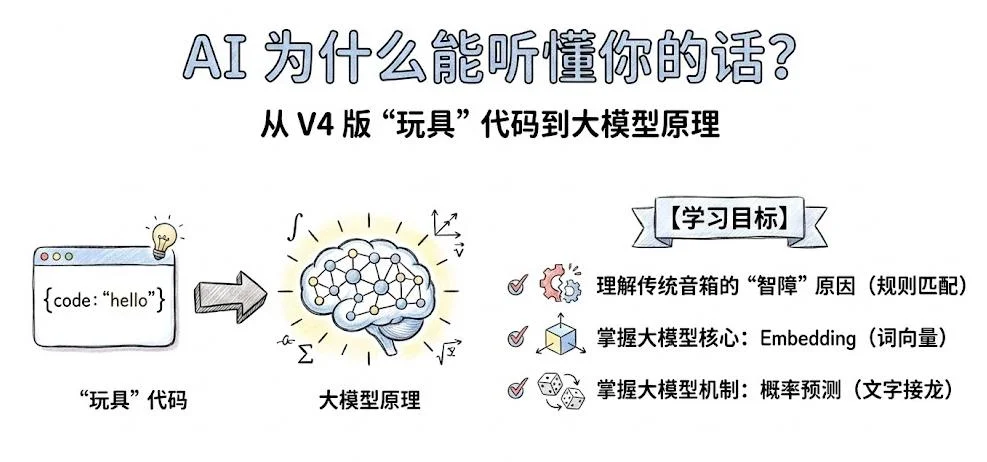

### 2.2 传统 vs 现代

- **传统智能音箱**：靠几万条规则做匹配，说不通就"我不太明白主人的意思"。
- **大模型 AI（DeepSeek / ChatGPT）**：规则匹配被打破，**大模型逻辑＝数学推理**。

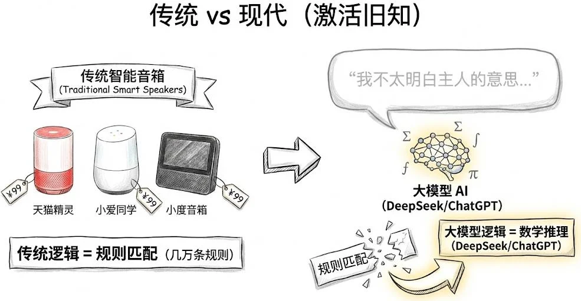

### 2.3 原理一：Embedding（词向量）

把词语变成数字（向量），例如用"厉害程度、性别倾向"两个维度表示：

| 词语       | 厉害程度 | 性别倾向 |
| ---------- | -------- | -------- |
| 国王 King  | 2        | 2        |
| 女王 Queen | 2        | 1        |
| 男人 Man   | 1        | 2        |
| 女人 Woman | 1        | 1        |

这些数值不是人标的，而是机器阅读海量文本后**自动生成**的。

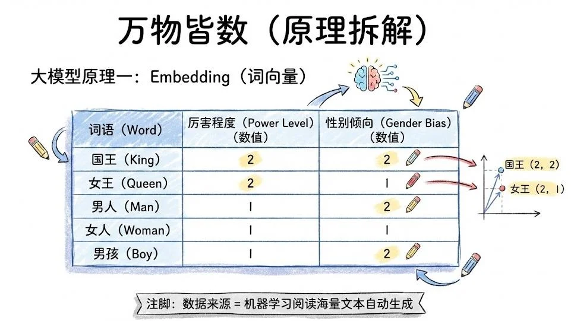

### 2.4 词语之间的代数运算

```text
国王(2,2) − 男人(1,2) + 女人(1,1) = (2,1) = 女王
```

> 计算机通过计算数字关系，理解了词义关系。

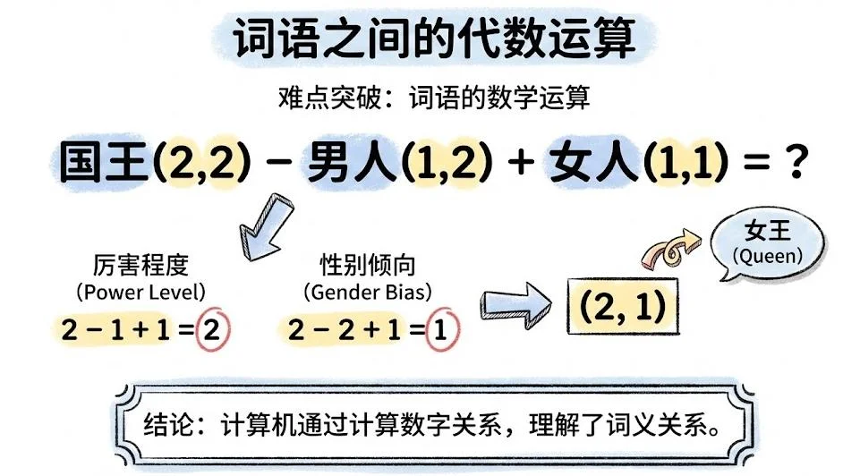

### 2.5 原理二：概率预测（Next Token Prediction）

给上文"今天天气"，模型预测下一个词：

| 候选 | 概率  |
| ---- | ----- |
| 晴朗 | 62%   |
| 不错 | 30%   |
| 香蕉 | 0.01% |
| 其它 | 7.99% |

> 基于上文推理下文，而非死记硬背。

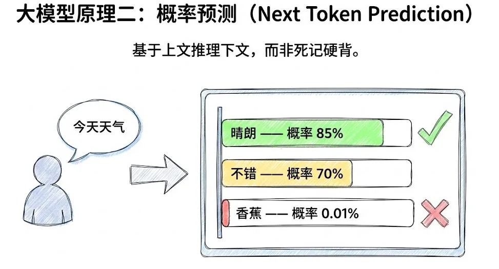

### 2.6 为什么 AI 是一个字一个字蹦出来的

因为它是**自回归（Auto-Regression）**：每次把"旧输入 + 刚生成的字"作为新输入，再预测下一个字。这不是为了模仿打字，而是**计算过程本身**。

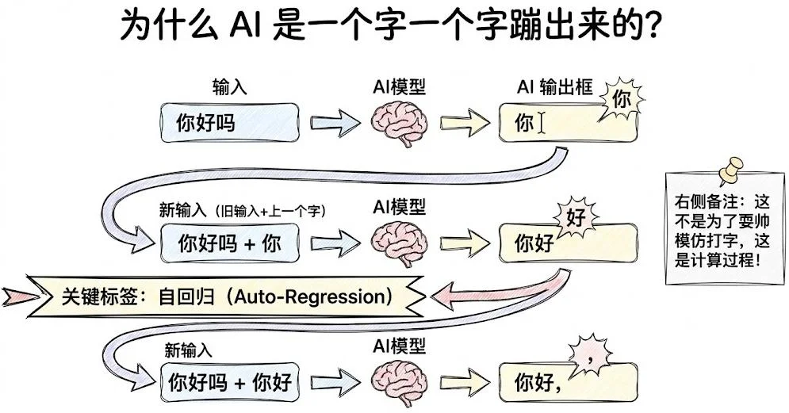

### 2.7 API：连接我们与大模型的桥梁

你不能直接进厨房炒菜（访问大模型服务器），需要通过**服务员（API）**传话。

- 顾客＝你 / Python 代码
- 服务员＝API
- 厨房＝大模型服务器
- 菜单＝请求数据，菜＝回答

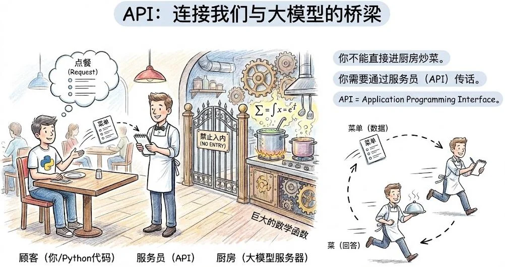

### 2.8 调用大模型的三把"钥匙"

| 钥匙                     | 含义                                          |
| ------------------------ | --------------------------------------------- |
| **Endpoint（Base URL）** | 服务器地址，如 DeepSeek / OpenAI 网址         |
| **API Key**              | 身份凭证（`sk-xxxx`），**绝密，不要发给别人** |
| **Payload（Prompt）**    | 你要寄出的信（提问内容）                      |

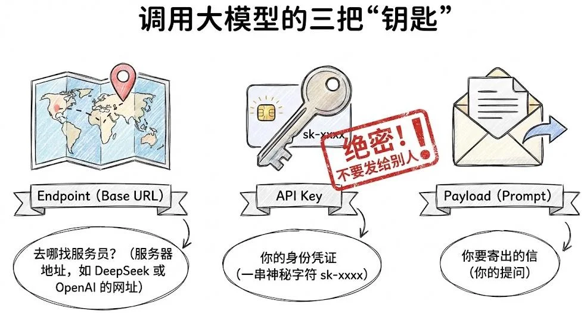

### 2.9 最简单的调用代码

```python
# 1. 引入库
from openai import OpenAI
# 2. 配置客户端（服务员）
client = OpenAI(
    api_key="sk-你的密钥",
    base_url="https://api.deepseek.com"
)
# 3. 发送请求（点菜）
response = client.chat.completions.create(
    model="deepseek-chat",
    messages=[{"role": "user", "content": "你好，你是谁？"}]
)
# 4. 打印结果（上菜）
print(response.choices[0].message.content)
```

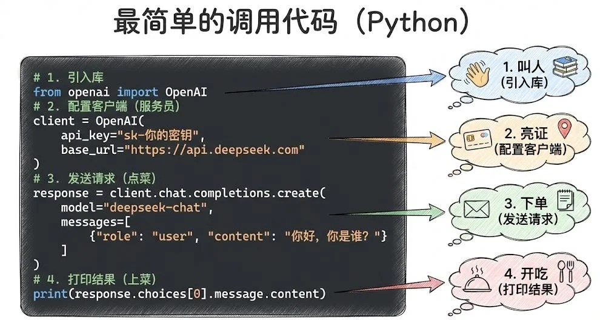

---

## 三、MCP 服务

### 3.1 为什么大模型需要 MCP

| 方案         | 问题/做法                                   |
| ------------ | ------------------------------------------- |
| 大模型的局限 | 只活在虚拟空间，无法直接干预物理世界        |
| 传统方案     | 硬编码适配，每加一个设备都要写大量冗余代码  |
| **MCP 方案** | 像 USB 一样即插即用，定义统一的"上下文协议" |

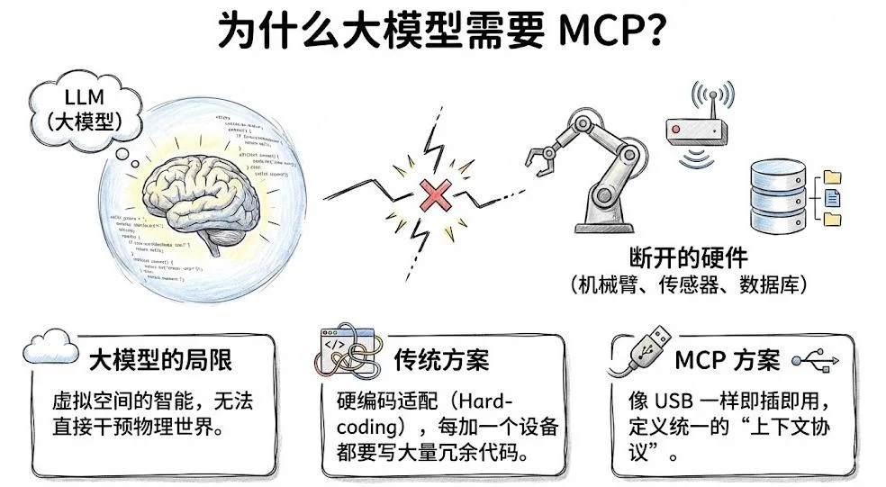

### 3.2 什么是 MCP

> **MCP（Model Context Protocol，模型上下文协议）**：由 Anthropic 公司在 2024 年底发布。

> [!WARNING] 注意
> 大模型因训练数据截断，往往无法回答最新的 MCP 细节——要查官方文档。

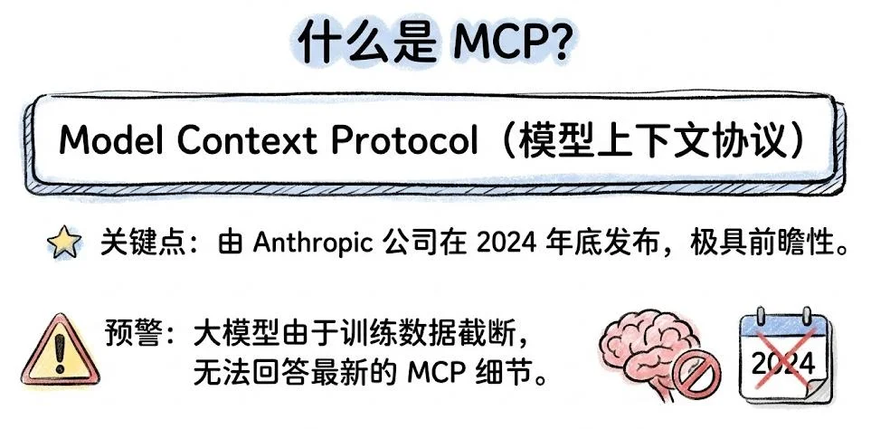

### 3.3 核心机制：MCP 与 USB 的类比

| USB                                         | MCP                                               |
| ------------------------------------------- | ------------------------------------------------- |
| 标准接口 + 各种外设（鼠标、摄像头、打印机） | 标准协议 + 各种服务器（数据库、机械臂、文件系统） |

> 作用：**解耦**——让大模型不再关心底层硬件逻辑，只关心"接口清单"。

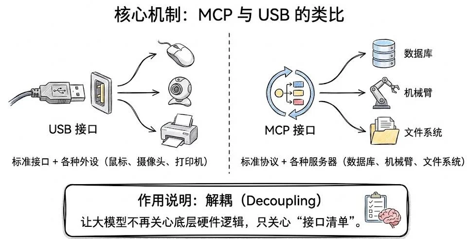

### 3.4 编写你的第一个 MCP Server

```bash
pip install fastmcp
```

Server 核心三步走：

1. **创建实例**：定义服务主体 `mcp = FastMCP("MyServer")`
2. **注册工具**：用 `@mcp.tool()` 注解，把功能暴露给 AI
3. **启动服务**：`mcp.run()` 开启监听

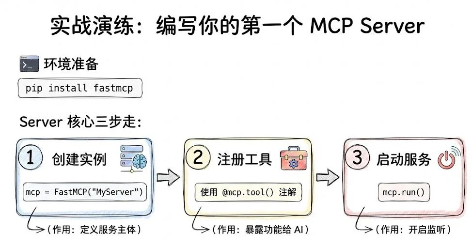

### 3.5 双端联调

```text
[Server] Starting MCP Server... Listening on 127.0.0.1:8000
[Client] Connected to 127.0.0.1:8000 → Discovering tools... → Result: 9
```

重点观察 Client 连接瞬间的**"握手"**与**"工具发现"**。

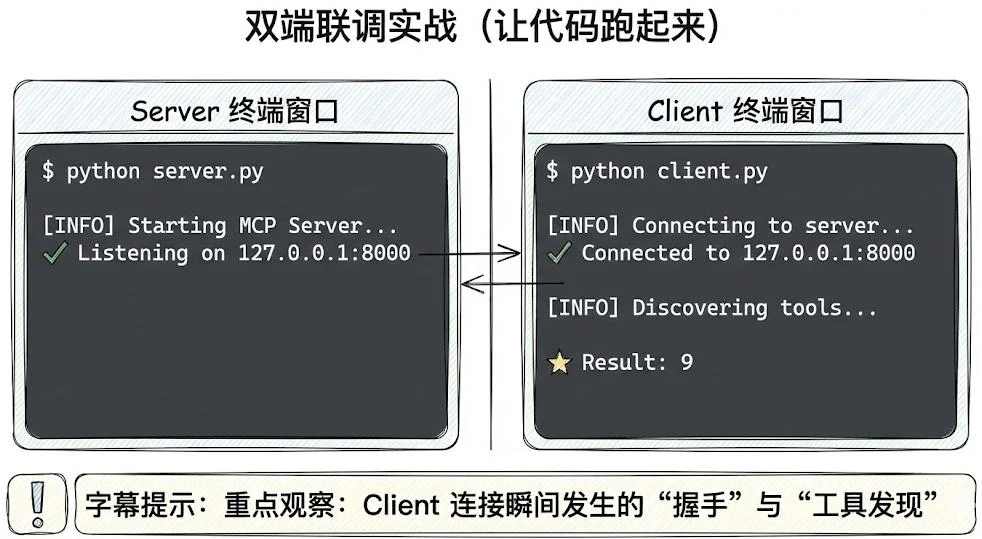

### 3.6 原理深挖：解耦与分布式

- **现状**：Server 和 Client 在同一台电脑。
- **未来**：Server 在工厂（机械臂），Client 在云端（大模型），中间通过网络连接。

> Server ＝ 能力提供者（硬件/工具）；Client ＝ 决策者（大模型）。

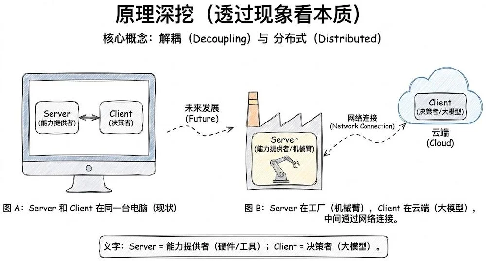

### 3.7 MCP 智能硬件

大模型（大脑）—— MCP 协议（桥梁）—— 机械臂（执行者）。

**工具列表（Tools List）**：`twist_waist()` 扭腰、`nod_head()` 点头、`lift_head()` 抬头。

交互流程：用户指令 → 大模型解析 → 匹配工具 → 驱动硬件。

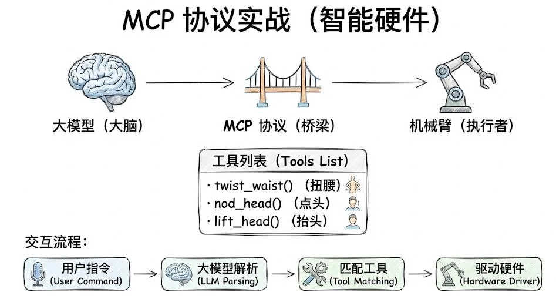

### 3.8 LLM + MCP = 智能大脑 + 灵活手脚

| 场景         | 流程                                                                |
| ------------ | ------------------------------------------------------------------- |
| **工具调用** | 提问"算一下 100+200" → 发现 `add` 工具 → MCP Server 执行 → 返回 300 |
| **直接回答** | 提问"介绍你自己" → 未发现工具 → 大模型直接兜底回答                  |

> 重点：强调"路由"和"分发"的概念。

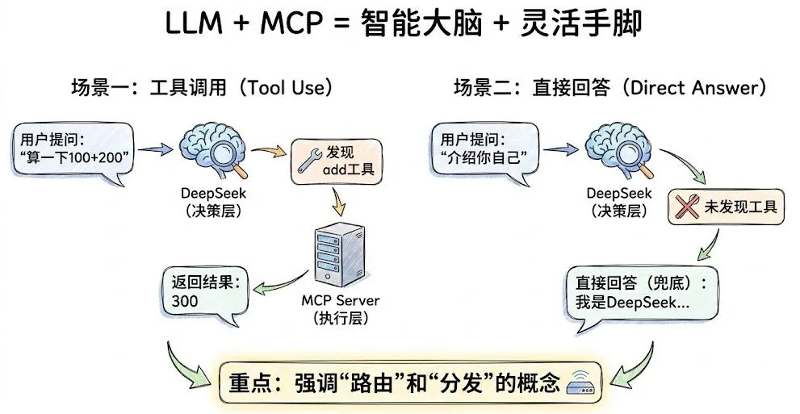
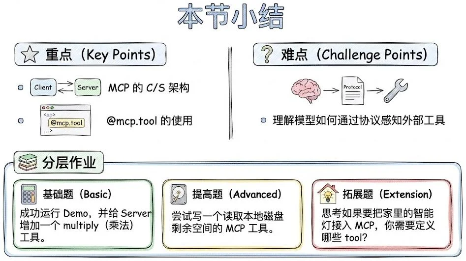

---

## 四、ROS 集成

### 4.1 实战升级：构建"机械臂"服务器

从"虚拟算术"切换到"物理控制"，任务卡 `MCP_Robot_Server`：

| 工具              | 作用     | 范围      |
| ----------------- | -------- | --------- |
| `rotate_waist`    | 腰部旋转 | [-90, 90] |
| `control_gripper` | 夹爪控制 | [0, -90]  |

技巧：借助 AI 辅助编程（Prompt Engineering）。

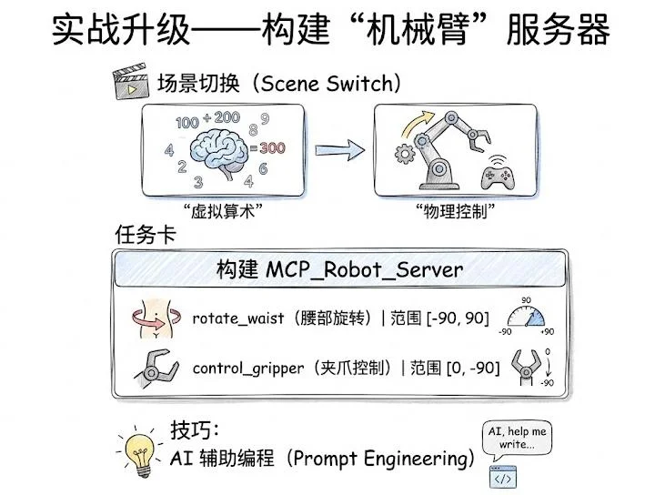

### 4.2 自然语言的魔力——"扭一下腰"

| 传统编程                                  | MCP + LLM                            |
| ----------------------------------------- | ------------------------------------ |
| `robot.rotate_waist(-45)`，必须精准写代码 | "你能向左扭一下腰吗？"，模糊语义理解 |

核心原理：**意图识别（Intent Recognition）→ 工具匹配（Tool Matching）→ 参数提取（Parameter Extraction）**。

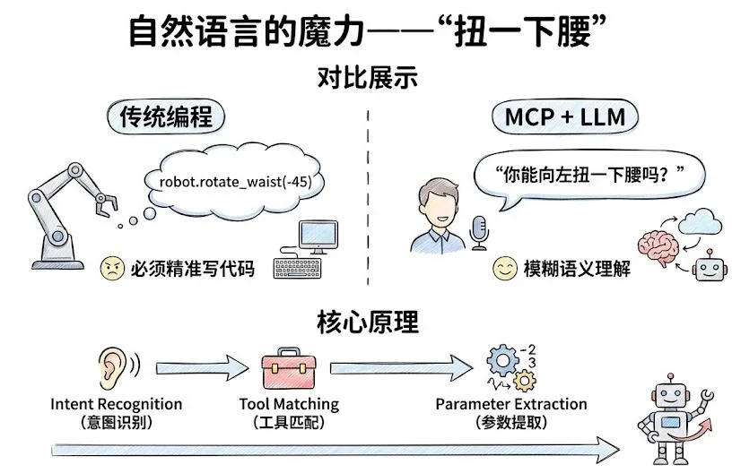

### 4.3 执行结果与未来展望

```text
[Server 日志] Calling tool: rotate_waist with args: {"angle": -90}
[Server 日志] Calling tool: control_gripper with args: {"angle": -45}
```

> 未来愿景：Smart Home（智能家居）＋ MCP ＋ LLM → **真正的全屋智能**。

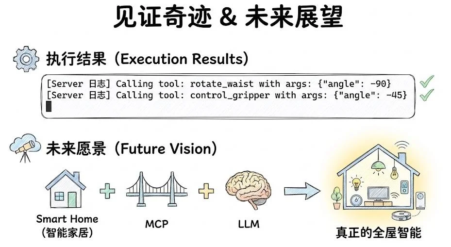

### 4.4 系统架构：MCP-to-Topic 桥接

全流程架构分为三层：

| 层                               | 组件                                        | 职责                             |
| -------------------------------- | ------------------------------------------- | -------------------------------- |
| **智能决策层（Intelligence）**   | User → MCP Agent → LLM                      | 决定调用哪个工具，发送 JSON 请求 |
| **转换与传输层（Bridge & Bus）** | MCP Server Node → ROS Topic Bus             | 把 JSON 转换成 ROS 消息并发布    |
| **执行层（Execution）**          | Worker Node → Robot Controller → 机器人底盘 | 订阅话题，驱动硬件动作           |

- MCP 接口：`Tool: dispatch_task`，`Args: {target, string, urgency: int}`
- ROS 接口：`Topic: /cmd_dispatch`，`Type: warehouse_msgs/DispatchCommand`
- QoS：`Reliability=Reliable`，`Durability=TransientLocal`

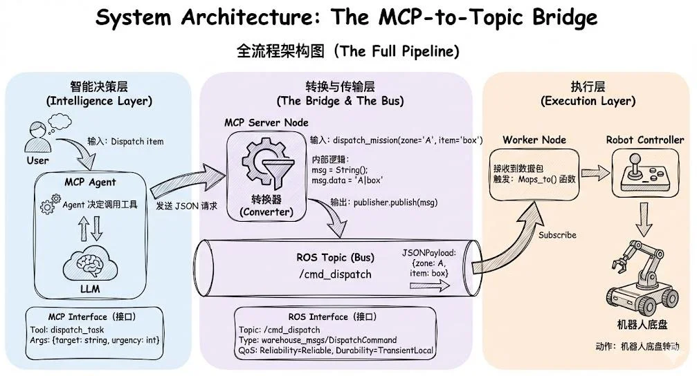

---

## 本章小结

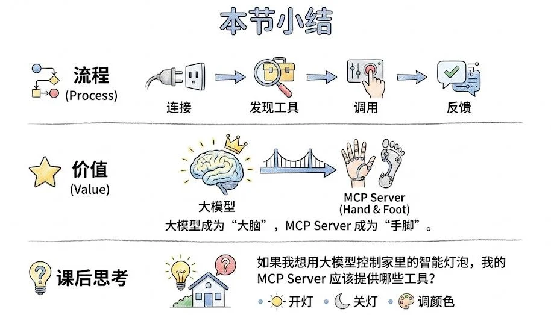

- **语音链路**：VAD → ASR → LLM → TTS，核心是"听到声音的图像"。
- **大模型原理**：Embedding 把词变成向量，概率预测 + 自回归逐字生成。
- **调用三钥匙**：Endpoint、API Key、Prompt。
- **MCP 的价值**：像 USB 一样解耦，让大模型成为"大脑"、MCP Server 成为"手脚"。
- **ROS 集成**：MCP Server 把 JSON 转成 ROS Topic 消息，驱动机械臂与底盘。

> 课后思考：如果要用大模型控制家里的智能灯泡，你的 MCP Server 应该提供哪些工具？（开灯 / 关灯 / 调颜色）
